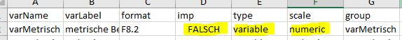
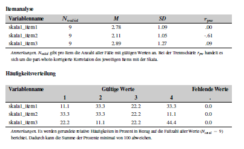
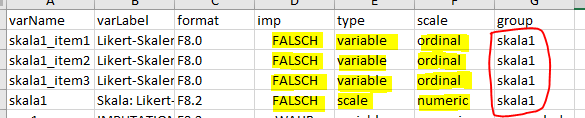

# Full Workflow

This vignettes describes the full workflow of creating a codebook via
the `eatCodebook` package. For illustrative purposes we use a small
example data set which comes alongside the package and contains
different types of variables (e.g., numeric, categorical, pooled
variables, scales). We import the data set using the `eatGADS` package,
which is automatically installed when `eatCodebook` is installed.

``` r
library(eatCodebook)
file <- system.file("extdata", "example2_clean.sav", package = "eatCodebook")
dat <- eatGADS::import_spss(file)
```

## Descriptive Statistics

One of the key elements of a codebook are descriptive statistics shortly
describing each variable in the data set. What kind of descriptive
statistics is reported for each variable depends on the type of the
variable. The function
[`createInputForDescriptives()`](https://beckerbenj.github.io/eatCodebook/reference/createInputForDescriptives.md)
creates a template to provide the information that is needed to
calculate the descriptive statistics for an `GADSdat` object. The
function has some arguments you can use to get a better result and less
manual editing in the next step.

``` r
inputForDescriptives <- createInputForDescriptives(GADSdat = dat)
#> Warning in FUN(data[x, , drop = FALSE], ...): Identification of fake scales
#> cannot be done completely automatically. Please check if the assignment of
#> which items belong to a common scale is correct.
head(inputForDescriptives)
#>              varName                                  varLabel format   imp
#> FALSE.1           ID                                      <NA>     A2 FALSE
#> FALSE.2        IDSCH                                      <NA>   F8.0 FALSE
#> FALSE.3  varMetrisch metrische Beispielvariable, Kompetenzwert   F8.2 FALSE
#> FALSE.4   varOrdinal ordinale Beispielvariable, Kompetenzstufe   F8.0 FALSE
#> FALSE.5       varCat                 nominale Beispielvariable     A1 FALSE
#> FALSE.6 skala1_item1                    Likert-Skalenindikator   F8.0 FALSE
#>             type   scale       group
#> FALSE.1 variable    <NA>          ID
#> FALSE.2 variable    <NA>       IDSCH
#> FALSE.3 variable numeric varMetrisch
#> FALSE.4 variable ordinal  varOrdinal
#> FALSE.5 variable    <NA>      varCat
#> FALSE.6     item ordinal      skala1
```

The template should be exported to `.xlsx`, modified and reimported to
`R`. Some information may need to be modified because the function does
not label it correctly. For this, it is necessary to understand the
functionality and check the variable entries.

``` r
writeExcel(inputForDescriptives, "file_path/inputForDescriptives.xlsx")
```

Here is a brief overview of the different columns in this object:

- **varName**: The name of the variable of the GADS-object
- **varLabel**: The label of the variable of the GADS-object
- **format**: The format of the variable of the GADS-object
- **imp**: Indicator if imputed variables are involved
- **type**: Indicator of whether it is a variable of a scale
- **scale**: Indicator of how the variable is to be represented
- **group**: Possibility to group variables

In the **varName**, **varLabel** and **format** columns are information
about the variables of the dataset. You don’t have to edit anything.  
**imp** can be set to *WAHR* or *FALSCH*. If there are several variables
to be displayed on one page, this column must be set to *WAHR* for these
variables and they must be assigned to the same group at **group**.  
**type** can be set to *variable* or *scale*. If it is a scale
consisting of several individual variables, the scale variable is set to
*scale* and the individual items to *variable*. All other variables
should always get *variable* as an entry.  
The **scale** column specifies how the variable is to be displayed. If
it is empty, no descreptives are displayed. *numeric* is a variable
without labeled categories. For *ordinal*, it is a categorical variable
that has labeled values.

Now follow the possibilities of how variables can be represented in the
codebook and how the table must be edited for this.

#### Variables without Descriptives

This can be the case, for example, with ID variables or character
variables. The page would then be displayed as follows:  
  
  
  
The entry must look like this:  
  


#### Numeric Variables without labeled Values

This can be used, for example, for variables that represent an age or
variables with values in the decimal range. Nevertheless, these
variables can contain labels for values. If they are defined as missing,
these values are not taken into account in the calculations but are
still reported.  
  
  
  
To create an entry for a numeric variable without labeled values, the
Excel must look like this:  
  


#### Categorial Variables

This is the page in the codebook, which is well suited for variables
that only have labeled categories:  
  
  
  
To create it, the Excel should be edited as follows:  
  
  
  

#### Scale Variables with individual items

It is possible to get the following entries in the codebook for a scale
and the items it is made of:  
  
  
  
To get these pages the individual items must be labeled as *ordinal* and
the scale as *numeric*. They must all have the same name at **group** so
that they are displayed together.  
  


#### Imputation Variables

For variables where an averaged value is to be determined and displayed
and depending on what was specified in **scale**, it results in the
following pages in the codebook:  
  
  
  
For getting this the **imp** column becomes relevant. It must be set to
*WAHR* for these variables. In addition, the variables also need a
common name in **group** and, depending on whether they are to be
represented categorically or numerically, the corresponding designation
in **scale**.  
  
  
  

After the table has been adjusted accordingly, it must be read in again
with the function
[`getInputForDescriptives()`](https://beckerbenj.github.io/eatCodebook/reference/getInputForDescriptives.md).

``` r
inputForDescriptives_edited <- getInputForDescriptives("file_path/inputForDescriptives.xlsx")
```

This input is then used to calculate descriptive statistics via
[`calculateDescriptives()`](https://beckerbenj.github.io/eatCodebook/reference/calculateDescriptives.md).

``` r
# just show function calls
showFunctions <- calculateDescriptives(GADSdat = dat, inputForDescriptives = inputForDescriptives_edited, showCallOnly = TRUE)
showFunctions <- data.frame(varName = names(showFunctions), functionName = as.vector(showFunctions), stringsAsFactors = FALSE)
showFunctions
#>           varName               functionName
#> 1       pv_pooled kennwerte.gepoolt.metrisch
#> 2    pvkat_pooled  kennwerte.gepoolt.ordinal
#> 3 skala_fake_item            kennwerte.skala
#> 4          skala1            kennwerte.skala
#> 5     varMetrisch         kennwerte.metrisch
#> 6      varOrdinal          kennwerte.ordinal
# acutally calculate descriptives
descStatistics <- calculateDescriptives(GADSdat = dat, inputForDescriptives = inputForDescriptives_edited, showCallOnly = FALSE)
#> Warning: the 'isNested' function has moved to the reformulas package. Please update your imports, or ask an upstream package maintainter to do so.
#> This warning is displayed once per session.
#> Warning: `report()` was deprecated in eatRep 0.15.0.
#> ℹ For the original behavior of report() please use eatRep version 0.14.7:
#>   'https://cran.r-project.org/src/contrib/Archive/eatRep/'
#> ℹ The deprecated feature was likely used in the eatCodebook package.
#>   Please report the issue to the authors.
#> This warning is displayed once every 8 hours.
#> Call `lifecycle::last_lifecycle_warnings()` to see where this warning was
#> generated.
descStatistics[[5]]
#>         N.valid      mean.valid        sd.valid       min.valid       max.valid 
#>             "7"        "484.19"         "83.36"         "362.1"         "609.1" 
#> sysmis.totalabs 
#>             "0"
```

If you want to document several data sets in the codebook, you must go
through these steps for all data sets and summarise the results in
lists. These lists can then be used instead of the individual objects
for the following functions.

## Value and Missing Labels

Another imported part of a codebook is the documentation of the value
labels of valid and missing values. A respective overview is created via
[`createMissings()`](https://beckerbenj.github.io/eatCodebook/reference/createMissings.md).

``` r
missings <- createMissings(dat, inputForDescriptives = inputForDescriptives_edited)
head(missings)
#>      Var.name Wert missing       LabelSH Zeilenumbruch_vor_Wert
#> 3 varMetrisch  -99      ja   not reached                   nein
#> 4 varMetrisch  -98      ja      omission                   nein
#> 5  varOrdinal    1    nein sehr schlecht                   nein
#> 6  varOrdinal    2    nein      schlecht                   nein
#> 7  varOrdinal    3    nein           gut                   nein
#> 8  varOrdinal    4    nein      sehr gut                   nein
```

In this case, the resulting object `missings` has to be written to
`xlsx` and imported via
[`getMissings()`](https://beckerbenj.github.io/eatCodebook/reference/getMissings.md).
Note that all the `getXXX` functions perform important cleaning and
preparation steps, therefore the exporting to `xlsx` is obligatory.

``` r
writeExcel(missings, "example_miss.xlsx", row.names = FALSE)
miss_final <- getMissings("example_miss.xlsx")
```

    #>      Var.name Wert missing       LabelSH Zeilenumbruch_vor_Wert
    #> 1 varMetrisch  -98      ja      omission                   nein
    #> 2 varMetrisch  -99      ja   not reached                   nein
    #> 3  varOrdinal    1    nein sehr schlecht                   nein
    #> 4  varOrdinal    2    nein      schlecht                   nein
    #> 5  varOrdinal    3    nein           gut                   nein
    #> 6  varOrdinal    4    nein      sehr gut                   nein

## Variable Information

With
[`createVarInfo()`](https://beckerbenj.github.io/eatCodebook/reference/createVarInfo.md)
the most important part of the codebook is created.

``` r
varInfo <- createVarInfo(dat, inputForDescriptives = inputForDescriptives_edited)
head(varInfo)
#>       Var.Name in.DS.und.SH Unterteilung.im.Skalenhandbuch Layout
#> 1           ID           ja                             NA      -
#> 2        IDSCH           ja                             NA      -
#> 3  varMetrisch           ja                             NA      -
#> 4   varOrdinal           ja                             NA      -
#> 5       varCat           ja                             NA      -
#> 6 skala1_item1           ds                             NA      -
#>                                     LabelSH Anmerkung.Var Gliederung
#> 1                                      <NA>             -          -
#> 2                                      <NA>             -          -
#> 3 metrische Beispielvariable, Kompetenzwert             -          -
#> 4 ordinale Beispielvariable, Kompetenzstufe             -          -
#> 5                 nominale Beispielvariable             -          -
#> 6                    Likert-Skalenindikator             -          -
#>   Reihenfolge                                     Titel rekodiert QuelleSH
#> 1          NA                                      <NA>      nein        -
#> 2          NA                                      <NA>      nein        -
#> 3          NA metrische Beispielvariable, Kompetenzwert      nein        -
#> 4          NA ordinale Beispielvariable, Kompetenzstufe      nein        -
#> 5          NA                 nominale Beispielvariable      nein        -
#> 6          NA                                         -      nein        -
#>   Instruktionen Hintergrundmodell HGM.Reihenfolge HGM.Variable.erstellt.aus
#> 1             -              nein               -                         -
#> 2             -              nein               -                         -
#> 3             -              nein               -                         -
#> 4             -              nein               -                         -
#> 5             -              nein               -                         -
#> 6             -              nein               -                         -
#>   intern.extern Seitenumbruch.im.Inhaltsverzeichnis
#> 1             -                                nein
#> 2             -                                nein
#> 3             -                                nein
#> 4             -                                nein
#> 5             -                                nein
#> 6             -                                nein
```

This object has to be saved again in an Excel, which has to be adjusted
by some manual steps. Here is a brief overview of the different columns
in this object:

- **Var.Name**: The name of the variable
- **in.DS.und.SH**: Indicator whether the variable is in the codebook
  and data set
- **Unterteilung.im.Skalenhandbuch**: Chapter Naming Overview
- **Layout**: Assignment of the layout options
- **LabelSH**: The label of the variable
- **Anmerkung.Var**: Assignment of annotations in the codebook
- **Gliederung**: Overview of chapter numbering
- **Reihenfolge**: Order of variables in the codebook
- **Titel**: Title of the codebook page of the variable
- **rekodiert**: Display whether a variable was previously recoded
- **QuelleSH**: Specification of the source of the variable in a
  questionnaire
- **Instruktionen**: Specification of the instructions of the variable
  in a questionnaire
- **Hintergrundmodell**: Indication of whether the variable is in the
  background model
- **HGM.Reihenfolge**: the order for the background model
- **HGM.Variable.erstellt.aus**: Indication for the background model
  from which variables the variable was created
- **intern.extern**: Indication of whether the variable is for internal
  or external use
- **Seitenumbruch.im.Inhaltsverzeichnis**: Indication whether there is a
  pagination in the table of contents for the title

The **in.DS.und.SH** column indicates whether a variable only appears in
the data set but does not get its own page (*ds*), whether it appears
both in the codebook and in the data set (*ja*), whether it only appears
in the scale manual (*sh*) or neither (*nein*). *ds* is assigned, for
example, for the items of the scale variables, as they do not receive
their own pages. *sh* for pooled variables, as they are shown in the
codebook but do not exist in the actual data set. *nein* can be assigned
for variables that are added independently. This can be the case, for
example, if you want to include them in the BGM information, but the
variables do not exist in the data set.  
The **Layout** column is automatically created after reading in using
[`inferLayout()`](https://beckerbenj.github.io/eatCodebook/reference/inferLayout.md).
In the **Anmerkung.Var** column, comments can be inserted (special text
highlighting or breaks must be in the latex logic), which are displayed
as annotations on the respective codebook page.  
The **Unterteilung.im.Skalenhandbuch** column gives the name for the
subchapters. In the **Gliederung** column, the chapter numbers must be
inserted. Subchapters such as “1.1”, “1.2”,… “2.1”. The naming of the
corresponding upper chapters is done in a later function. The naming of
the subchapters and the corresponding numbers must always be identical
for the variables.  
In the **Reihenfolge** column, the order of the variables for the
codebook can be specified. However, the order of the subchapters is
superordinate to this sorting. If the column is left empty, the order in
the table corresponds to the order in the codebook.  
The **Titel** column specifies the title for the page and defaults to
the variable label.  
If a variable has been recoded in the course of previous editing, this
can be marked with a *ja* in the **rekodiert** column and the variable
gets a corresponding note in the codebook as inverted if it is an item
of a scale.  
In **QuelleSH**, the short version of a bibliography can be specified.
Based on this, there is a later function that creates the bibliography
and in which one can specify the long version of the source.  
In the **Instruktionen** column, you can use a latex code to indicate
which instruction was used to collect the variable in a questionnaire.  
With `eatCodebook` you can also create a page for a background model
(BGM).


For the variable to appear there, the **Hintergrundmodell** column must
be set to *ja*. Otherwise, there must be a *nein*. With
**HGM.Reihenfolge** you can control the order in the codebook. In the
**HGM.Variable.erstellt.aus** column, variables can be specified that
make up the variable in question. These are then displayed in the
position marked yellow in the image.

``` r
writeExcel(varInfo, "example_varInfo.xlsx", row.names = FALSE)
varInfo_final <- getVarInfo("example_varInfo.xlsx")
varInfo_final2 <- inferLayout(varInfo_final, GADSdat = dat, inputForDescriptives = inputForDescriptives_edited)
```

    #>       Var.Name in.DS.und.SH Unterteilung.im.Skalenhandbuch Layout
    #> 1           ID           ja                             BG      -
    #> 2        IDSCH           ja                             BG      -
    #> 3  varMetrisch           ja                             BG      -
    #> 4   varOrdinal           ja                             BG      -
    #> 5       varCat           ja                             BG      -
    #> 6 skala1_item1           ds                          Scale      -
    #>                                     LabelSH Anmerkung.Var Gliederung
    #> 1                                      <NA>             -        1.1
    #> 2                                      <NA>             -        1.1
    #> 3 metrische Beispielvariable, Kompetenzwert             -        1.1
    #> 4 ordinale Beispielvariable, Kompetenzstufe             -        1.1
    #> 5                 nominale Beispielvariable             -        1.1
    #> 6                    Likert-Skalenindikator             -        1.2
    #>   Reihenfolge                                     Titel rekodiert
    #> 1           0                               Schueler-ID      nein
    #> 2           0                                 School-ID      nein
    #> 3           0 metrische Beispielvariable, Kompetenzwert      nein
    #> 4           0 ordinale Beispielvariable, Kompetenzstufe      nein
    #> 5           0                 nominale Beispielvariable      nein
    #> 6           0                                         -      nein
    #>         QuelleSH Instruktionen Hintergrundmodell HGM.Reihenfolge
    #> 1              -             -              nein               -
    #> 2              -             -              nein               -
    #> 3              -             -                ja               -
    #> 4 Mueller (2019)             -                ja               -
    #> 5              -             -              nein               -
    #> 6              -             -              nein               -
    #>   HGM.Variable.erstellt.aus intern.extern Seitenumbruch.im.Inhaltsverzeichnis
    #> 1                         -             -                                nein
    #> 2                         -             -                                nein
    #> 3                         -             -                                nein
    #> 4                         -             -                                nein
    #> 5                         -             -                                nein
    #> 6                         -             -                                nein

## Structure

The first foundations for the chapter structure are already laid in the
VarInfo. The function
[`createStructure()`](https://beckerbenj.github.io/eatCodebook/reference/createStructure.md)
is needed to name the upper chapters.

``` r
struc <- createStructure(varInfo_final)
head(struc)
#>     Titel Ebene
#> 1.1  <NA>     1
#> 1.2    BG   1.1
#> 1.3 Scale   1.2
#> 2.1  <NA>     2
#> 2.2   PVs   2.1
```

``` r
writeExcel(struc, "example_struc.xlsx", row.names = FALSE)
struc_final <- getStructure("example_struc.xlsx")
```

    #>         Titel Ebene
    #> 1  Background     1
    #> 2          BG   1.1
    #> 3       Scale   1.2
    #> 4 Competences     2
    #> 5         PVs   2.1

## Scale Information

In order to display the scales correctly, it also needs the function
[`createScaleInfo()`](https://beckerbenj.github.io/eatCodebook/reference/createScaleInfo.md).

``` r
scaleInfo <- createScaleInfo(inputForDescriptives_edited)
head(scaleInfo)
#>           varName Anzahl_valider_Werte
#> 1          skala1                    -
#> 2 skala_fake_item                    -
#> 3       pv_pooled                    -
#> 4    pvkat_pooled                    -
#>                                      Items_der_Skala
#> 1             skala1_item1,skala1_item2,skala1_item3
#> 2 skala_fake_item1,skala_fake_item2,skala_fake_item3
#> 3                                                   
#> 4                                                   
#>                              Imputationen
#> 1                                        
#> 2                                        
#> 3                pv_1,pv_2,pv_3,pv_4,pv_5
#> 4 pvkat_1,pvkat_2,pvkat_3,pvkat_4,pvkat_5
```

``` r
writeExcel(scaleInfo, "example_scaleInfo.xlsx", row.names = FALSE)
scaleInfo_final <- getScaleInfo("example_scaleInfo.xlsx")
```

    #>           varName Anzahl_valider_Werte
    #> 1          skala1                    -
    #> 2 skala_fake_item                    -
    #> 3       pv_pooled                    -
    #> 4    pvkat_pooled                    -
    #>                                      Items_der_Skala
    #> 1             skala1_item1,skala1_item2,skala1_item3
    #> 2 skala_fake_item1,skala_fake_item2,skala_fake_item3
    #> 3                           pv_1,pv_2,pv_3,pv_4,pv_5
    #> 4            pvkat_1,pvkat_2,pvkat_3,pvkat_4,pvkat_5
    #>                              Imputationen
    #> 1                                        
    #> 2                                        
    #> 3                pv_1,pv_2,pv_3,pv_4,pv_5
    #> 4 pvkat_1,pvkat_2,pvkat_3,pvkat_4,pvkat_5

## Literature Information

The literature information contains the sources which should be cited
within the codebook. It builds on the references mentioned in the
VarInfo. The latex code must also be used here.

``` r
litInfo <- createLitInfo(varInfo_final)
head(litInfo)
#>       Kurzangabe Langangabe in_Literaturverzeichnis
#> 1 Mueller (2019)         NA                      NA
```

``` r
writeExcel(litInfo, "example_litInfo.xlsx", row.names = FALSE)
litInfo_final <- getLitInfo("example_litInfo.xlsx")
```

    #>       Kurzangabe                 Langangabe in_Literaturverzeichnis
    #> 1 Mueller (2019) Mueller, M. (2020). Titel.                      ja

## Abbreviation List

An abbreviation list can be added which explains abbreviations or
statistical symbols used throughout the codebook. The latex code must
also be used here.

``` r
abbrList <- createAbbrList()
abbrList
#> $Akronyme
#> [1] Abkuerzung Bedeutung 
#> <0 rows> (or 0-length row.names)
#> 
#> $`Statistische Formelzeichen`
#> [1] Symbol    Bedeutung
#> <0 rows> (or 0-length row.names)
```

``` r
writeExcel(abbrList, "example_abbrList.xlsx", row.names = FALSE)
abbrList_final <- makeAbbrList("example_abbrList.xlsx")
```

## Cover Page

A cover page can be added to the codebook. On the one hand, there is
this possibility.

``` r
cover <- makeCover(logoFile = NULL,
                   maintitle = "Study of Achievement",
                   subtitle = "Codebook of Study of Achievement",
                   authors = "Some Person",
                   addAuthors = "With the help of some other persons",
                   schriftenreihe = "Book 9 of Studies of Achievement",
                   bibinfo = "test")
```

However, this can also be done by reading in a self-designed PDF page.
This must simply be assigned to the object.

## Meta data

Meta data can be added to the codebook.

``` r
meta <- createMetadata()
meta[1, "Title"] <- "Codebook Test"
meta[1, "Author"] <- "Anna Muster"
meta[1, "Keywords"] <- "lsa, education"
meta[1, "Subject"] <- "test"
```

``` r
writeExcel(abbrList, "example_meta.xlsx", row.names = FALSE)
meta_final <- makeMetadata("example_meta.xlsx")
```

## Further make steps

Finally, the previously prepared bibliography and background model still
need to be finalised. This is done using the following syntax.

``` r
lit <- makeLit(litInfo_final)
hint <- makeBGM(varInfo_final)
#> Es liegen keine numerischen Angaben für die Reihenfolge vor. Durch das Einlesen mithilfe von getVarInfo() kann sich die Variablen-Reihenfolge geändert haben. Diese wird nun als Grundlage genutzt.
```

## Chapters

Create the chapter structure. Furthermore, the name of the top chapter
is assigned here. The name of the data set.

``` r
chapters <- createChapters(varInfo_final2)
chapters[, 2] <- "Datensatz"
```

## Codebook

Now we create the actual codebook script via calling the
[`codebook()`](https://beckerbenj.github.io/eatCodebook/reference/codebook.md)
function. Here, latex code can also be inserted at **intro** and
**lastpage**, for example to write introductory texts or to design a
last page.

``` r
descStatistics2 <- descStatistics
descStatistics2$skala1[[2]] <- as.data.frame(descStatistics2$skala1[[2]])
latex_skript <- codebook(varInfo = varInfo_final2, missings = miss_final, struc = struc_final,
                         scaleInfo = scaleInfo_final, 
                         dat = eatGADS::extractData(dat), Kennwertedatensatz = descStatistics2, 
                         chapters = chapters, deckblatt = cover, intro = "", literatur = lit, 
                         abkuerzverz = abbrList_final, hintmod = hint, lastpage = "")
#> 
#>  Erstelle Layout-Skripte fuer: dat
#>   Layout der Variable: ID
#>   Layout der Variable: IDSCH
#>   Layout der Variable: varMetrisch
#>   Layout der Variable: varOrdinal
#>   Layout der Variable: varCat
#>   Layout der Variable: skala1
#>   Layout der Variable: skala_fake_item
#>   Layout der Variable: pv_pooled
#>   Layout der Variable: pvkat_pooled
```
