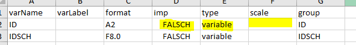
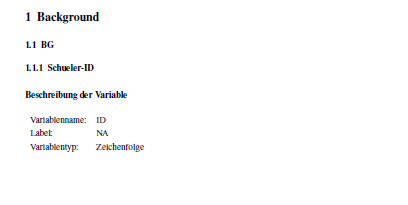
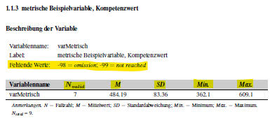
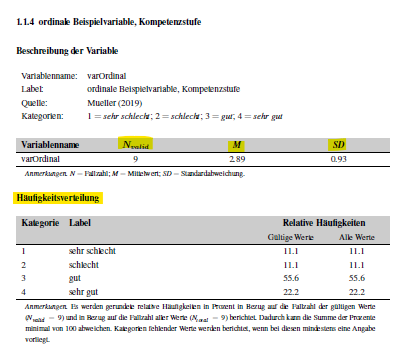
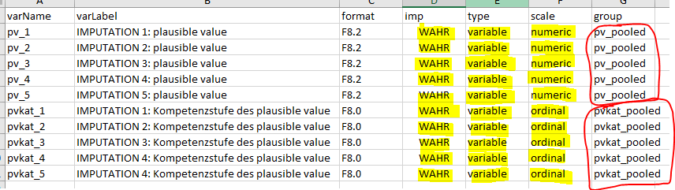
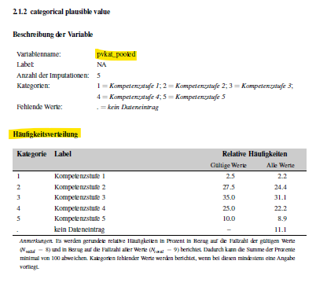

--- 
title: "Full Workflow"
date: "`r Sys.Date()`"
output: rmarkdown::html_vignette
vignette: >
  %\VignetteIndexEntry{Full Workflow}
  %\VignetteEngine{knitr::rmarkdown}
  %\VignetteEncoding{UTF-8}
---
  
```{r, include = FALSE}
knitr::opts_chunk$set(
  collapse = TRUE,
  comment = "#>"
)
```

This vignettes describes the full workflow of creating a codebook via the `eatCodebook` package. For illustrative purposes we use a small example data set which comes alongside the package and contains different types of variables (e.g., numeric, categorical, pooled variables, scales). We import the data set using the `eatGADS` package, which is automatically installed when `eatCodebook` is installed.

```{r setup}
library(eatCodebook)
file <- system.file("extdata", "example1_clean.sav", package = "eatCodebook")
dat <- eatGADS::import_spss(file)
```

## Descriptive Statistics
One of the key elements of a codebook are descriptive statistics shortly describing each variable in the data set. What kind of descriptive statistics is reported for each variable depends on the type of the variable. The function `createInputForDescriptives()` creates a template to provide the information that is needed to calculate the descriptive statistics for an `GADSdat` object. The function has some arguments you can use to get a better result and less manual editing in the next step.

```{r createInputForDescriptives}
inputForDescriptives <- createInputForDescriptives(GADSdat = dat)
head(inputForDescriptives)
```

The template should be exported to `.xlsx`, modified and reimported to `R`. Some information may need to be modified because the function does not label it correctly. For this, it is necessary to understand the functionality and check the variable entries.  

```{r export varinfo, eval=FALSE}
writeExcel(inputForDescriptives, "file_path/inputForDescriptives.xlsx")
```

Here is a brief overview of the different columns in this object:  

* **varName**: The name of the variable of the GADS-object
* **varLabel**: The label of the variable of the GADS-object
* **format**: The format of the variable of the GADS-object
* **imp**: Indicator if imputed variables are involved
* **type**: Indicator of whether it is a variable of a scale
* **scale**: Indicator of how the variable is to be represented
* **group**: Possibility to group variables

In the **varName**, **varLabel** and **format** columns are information about the variables of the dataset. You don't have to edit anything.  
**imp** can be set to *WAHR* or *FALSCH*. If there are several variables to be displayed on one page, this column must be set to *WAHR* for these variables and they must be assigned to the same group at **group**.  
**type** can be set to *variable* or *scale*. If it is a scale consisting of several individual variables, the scale variable is set to *scale* and the individual items to *variable*. All other variables should always get *variable* as an entry.  
The **scale** column specifies how the variable is to be displayed. If it is empty, no descreptives are displayed. *numeric* is a variable without labelled categories. For *ordinal*, it is a categorical variable that has labelled values.

Consequently, to get a codebook page that represents the variable without any descriptives, the entry must look like this:  

  

This can be the case, for example, with ID variables or character variables. The page would then be displayed as follows:  

  
<br> <br>
To create an entry for a numeric variable without labelled values, the Excel must look like this: 

  

This creates the following page. This can be used, for example, for variables that represent an age or variables with values in the decimal range. Nevertheless, these variables can contain labels for values. If they are defined as missing, these values are not taken into account in the calculations but are still reported.  

 
<br> <br>
To display a categorical variable, the Excel should be edited as follows:  

  

This creates the following page in the codebook, which is well suited for variables that only have labelled categories:  


<br> <br>
If there is a scale and individual items in the data set, then these must be labelled in Excel as follows. The individual items are labelled as *ordinal* and the scale as *numeric*. They must all have the same name at **group** so that they are displayed together.  

  

This logic leads to the following entries in the scale manual for the variables:  


<br> <br>
For variables where an averaged value is to be determined and displayed, the **imp** column becomes relevant. This must be set to *WAHR* for these variables. In addition, the variables also need a common name in **group** and, depending on whether they are to be represented categorically or numerically, the corresponding designation in **scale**.  

  

Depending on what was specified in **scale**, it results in the following pages in the codebook:  

  
<br> <br>
After the table has been adjusted accordingly, it must be read in again with the function `getInputForDescriptives()`.

```{r import varinfo, eval=FALSE}
inputForDescriptives_edited <- getInputForDescriptives("file_path/inputForDescriptives.xlsx")
```

```{r edit varinfo, echo=FALSE}
inputForDescriptives_edited <- inputForDescriptives
```


This input is then used to calculate descriptive statistics via `calculateDescriptives()`.

```{r calculate descr}
# just show function calls
showFunctions <- calculateDescriptives(GADSdat = dat, inputForDescriptives = inputForDescriptives_edited, showCallOnly = TRUE)
showFunctions <- data.frame(varName = names(showFunctions), functionName = as.vector(showFunctions), stringsAsFactors = FALSE)
showFunctions
# acutally calculate descriptives
descStatistics <- calculateDescriptives(GADSdat = dat, inputForDescriptives = inputForDescriptives_edited, showCallOnly = FALSE)
descStatistics[[5]]
```

If you want to document several data sets in the codebook, you must go through these steps for all data sets and summarise the results in lists. These lists can then be used instead of the individual objects for the following functions. 

## Value and Missing Labels
Another imported part of a codebook is documentation of the value labels of valid and missing values. A respective overview is created via `createMissings()`.

```{r create missings}
missings <- createMissings(dat, inputForDescriptives = inputForDescriptives_edited)
head(missings)
```

In this case, the resulting object `missings` has to be written to `xlsx` and imported via `getMissings()`. Note that alle the `getXXX` functions perform important cleaning and preparation steps, therefore the exporting to `xlsx` is obligatory.

```{r write missings, eval = FALSE}
writeExcel(miss, "example_miss.xlsx", row.names = FALSE)
miss_final <- getMissings("example_miss.xlsx")
```

```{r load missings, eval = TRUE, echo = FALSE}
miss_file <- system.file("extdata", "example_miss.xlsx", package = "eatCodebook")
miss_final <- getMissings(miss_file)
head(miss_final)
```


## Variable Information
With `createVarInfo()` the most important part of the codebook is created.

```{r create varInfo}
varInfo <- createVarInfo(dat, inputForDescriptives = inputForDescriptives_edited)
head(varInfo)
```

This object has to be saved again in an Excel, which has to be adjusted by some manual steps. 
Here is a brief overview of the different columns in this object:

* **Var.Name**: The name of the variable
* **in.DS.und.SH**: Indicator whether the variable is in the codebook and data set
* **Unterteilung.im.Skalenhandbuch**: Chapter Naming Overview
* **Layout**: Assignment of the layout options
* **LabelSH**: The label of the variable
* **Anmerkung.Var**: Assignment of annotations in the codebook
* **Gliederung**: Overview of chapter numbering
* **Reihenfolge**: Order of variables in the codebook
* **Titel**: Title of the codebook page of the variable
* **rekodiert**: Display whether a variable was previously recoded
* **QuelleSH**: Specification of the source of the variable in a questionnaire
* **Instruktionen**: Specification of the instructions of the variable in a questionnaire
* **Hintergrundmodell**: Indication of whether the variable is in the background model
* **HGM.Reihenfolge**: the order for the background model
* **HGM.Variable.erstellt.aus**: Indication for the background model from which variables the variable was created
* **intern.extern**: Indication of whether the variable is for internal or external use
* **Seitenumbruch.im.Inhaltsverzeichnis**: Indication whether there is a pagination in the table of contents for the title

The **in.DS.und.SH** column indicates whether a variable only appears in the data set but does not get its own page (*ds*), whether it appears both in the codebook and in the data set (*ja*), whether it only appears in the scale manual (*sh*) or neither (*nein*). *ds* is assigned, for example, for the items of the scale variables, as they do not receive their own pages. *sh* for pooled variables, as they are shown in the codebook but do not exist in the actual data set. *nein* can be assigned for variables that are added independently. This can be the case, for example, if you want to include them in the BGM information, but the variables do not exist in the data set.  
The **Layout** column is automatically created after reading in using `inferLayout()`. In the **Anmerkung.Var** column, comments can be inserted (special text highlighting or breaks must be in the latex logic), which are displayed as annotations on the respective codebook page.  
The **Unterteilung.im.Skalenhandbuch** column gives the name for the subchapters. In the **Gliederung** column, the chapter numbers must be inserted. Subchapters such as "1.1", "1.2",... "2.1". The naming of the corresponding upper chapters is done in a later function. The naming of the subchapters and the corresponding numbers must always be identical for the variables.  
In the **Reihenfolge** column, the order of the variables for the codebook can be specified. However, the order of the subchapters is superordinate to this sorting. If the column is left empty, the order in the table corresponds to the order in the codebook.  
The **Titel** column specifies the title for the page and defaults to the variable label.  
If a variable has been recoded in the course of previous editing, this can be marked with a *ja* in the **rekodiert** column and the variable gets a corresponding note in the codebook as inverted if it is an item of a scale.  
In **QuelleSH**, the short version of a bibliography can be specified. Based on this, there is a later function that creates the bibliography and in which one can specify the long version of the source.  
In the **Instruktionen** column, you can use a latex code to indicate which instruction was used to collect the variable in a questionnaire.  
With `eatCodebook` you can also create a page for a background model (BGM).  

   

For the variable to appear there, the **Hintergrundmodell** column must be set to *ja*. Otherwise, there must be a *nein*. With **HGM.Reihenfolge** you can control the order in the codebook. In the **HGM.Variable.erstellt.aus** column, variables can be specified that make up the variable in question. These are then displayed in the position marked yellow in the image.

```{r write varInfo, eval = FALSE}
writeExcel(miss, "example_varInfo.xlsx", row.names = FALSE)
varInfo_final <- getVarInfo("example_varInfo.xlsx")
varInfo_final2 <- inferLayout(varInfo_final, GADSdat = dat, inputForDescriptives = inputForDescriptives_edited)
```

```{r load varInfo, eval = TRUE, echo = FALSE}
varInfo_file <- system.file("extdata", "example_varInfo.xlsx", package = "eatCodebook")
varInfo_final <- getVarInfo(varInfo_file)
varInfo_final2 <- inferLayout(varInfo_final, GADSdat = dat, inputForDescriptives = inputForDescriptives_edited)
head(varInfo_final)
```

## Structure
The first foundations for the chapter structure are already laid in the VarInfo. The function `createStructure()` is needed to name the upper chapters. 

```{r create struc}
struc <- createStructure(varInfo_final)
head(struc)
```

```{r write struc, eval = FALSE}
writeExcel(struc, "example_struc.xlsx", row.names = FALSE)
struc_final <- getStructure("example_struc.xlsx")
```

```{r load struc, eval = TRUE, echo = FALSE}
struc_file <- system.file("extdata", "example_struc.xlsx", package = "eatCodebook")
struc_final <- getStructure(struc_file)
head(struc_final)
```

## Scale Information
In order to display the scales correctly, it also needs the function `createScaleInfo()`. 

```{r create scaleInfo}
scaleInfo <- createScaleInfo(inputForDescriptives_edited)
head(scaleInfo)
```

```{r write scaleInfo, eval = FALSE}
writeExcel(scaleInfo, "example_scaleInfo.xlsx", row.names = FALSE)
scaleInfo_final <- getScaleInfo("example_scaleInfo.xlsx")
# workaround, should be done automatically, but currently problem with non list inputs for createScaleInfo
scaleInfo_final$Quelle <- "dat"
```

```{r load scaleInfo, eval = TRUE, echo = FALSE}
scaleInfo_file <- system.file("extdata", "example_scaleInfo.xlsx", package = "eatCodebook")
scaleInfo_final <- getScaleInfo(scaleInfo_file)
# workaround, should be done automatically, but currently problem with non list inputs for createScaleInfo
scaleInfo_final$Quelle <- "dat"
head(scaleInfo_final)
```


## Literature Information
The literature information contains the sources which should be cited within the codebook. It builds on the references mentioned in the VarInfo. The latex code must also be used here.

```{r create litInfo}
litInfo <- createLitInfo(varInfo_final)
head(litInfo)
```

```{r write litInfo, eval = FALSE}
writeExcel(register, "example_litInfo.xlsx", row.names = FALSE)
litInfo_final <- getLitInfo("example_litInfo.xlsx")
```

```{r load litInfo, eval = TRUE, echo = FALSE}
litInfo_file <- system.file("extdata", "example_litInfo.xlsx", package = "eatCodebook")
litInfo_final <- getLitInfo(litInfo_file)
head(litInfo_final)
```


## Abbreviation List
An abbreviation list can be added which explains abbreviations or statistical symbols used throughout the codebook. The latex code must also be used here.

```{r create abbrList}
abbrList <- createAbbrList()
abbrList
```

```{r write abbrList, eval = FALSE}
writeExcel(abbrList, "example_abbrList.xlsx", row.names = FALSE)
abbrList_final <- makeAbbrList("example_abbrList.xlsx")
```

```{r load abbrList, eval = TRUE, echo = FALSE}
abbrList_file <- system.file("extdata", "example_abbrList.xlsx", package = "eatCodebook")
abbrList_final <- makeAbbrList(abbrList_file)
```

## Cover Page
A cover page can be added to the codebook. On the one hand, there is this possibility.

```{r create cover}
cover <- makeCover(logoFile = NULL,
                   maintitle = "Study of Achievement",
                   subtitle = "Codebook of Study of Achievement",
                   authors = "Some Person",
                   addAuthors = "With the help of some other persons",
                   schriftenreihe = "Book 9 of Studies of Achievement",
                   bibinfo = "test")
```

However, this can also be done by reading in a self-designed PDF page. This must simply be assigned to the object.

## Meta data
Meta data can be added to the codebook.

```{r create meta data}
meta <- createMetadata()
meta[1, "Title"] <- "Codebook Test"
meta[1, "Author"] <- "Anna Muster"
meta[1, "Keywords"] <- "lsa, education"
meta[1, "Subject"] <- "test"
```

```{r write meta data, eval = FALSE}
writeExcel(abbrList, "example_meta.xlsx", row.names = FALSE)
meta_final <- makeMetadata("example_meta.xlsx")
```

```{r load meta data, eval = TRUE, echo = FALSE}
meta_file <- system.file("extdata", "example_meta.xlsx", package = "eatCodebook")
meta_final <- makeMetadata(meta_file)
```

## Further make steps
Finally, the previously prepared bibliography and background model still need to be finalised. This is done using the following syntax.

```{r make steps}
lit <- makeLit(litInfo_final)
hint <- makeBGM(varInfo_final)
```

## Chapters
Create the chapter structure. Furthermore, the name of the top chapter is assigned here. The name of the data set.

```{r chapters}
chapters <- createChapters(varInfo_final2)
chapters[, 2] <- "Datensatz"
```


## Codebook
Now we create the actual codebook script via calling the `codebook()` function. Here, latex code can also be inserted at **intro** and **lastpage**, for example to write introductory texts or to design a last page.

```{r codebook, message=TRUE}
descStatistics2 <- descStatistics
descStatistics2$skala1[[2]] <- as.data.frame(descStatistics2$skala1[[2]])
latex_skript <- codebook(varInfo = varInfo_final2, missings = miss_final, struc = struc_final,
                         scaleInfo = scaleInfo_final, 
                         dat = eatGADS::extractData(dat), Kennwertedatensatz = descStatistics2, 
                         chapters = chapters, deckblatt = cover, intro = "", literatur = lit, 
                         abkuerzverz = abbrList_final, hintmod = hint, lastpage = "")
```
