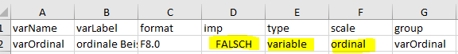

```{r setup, include=FALSE}
knitr::opts_chunk$set(
  collapse = TRUE,
  comment = "#>"
)
```

# Intro

## Goal of the Vignette

This vignettes describes the full workflow of creating a codebook (or Skalenhandbuch) via the `eatCodebook` package. For illustrative purposes we use a small example data set which comes alongside the package and contains different types of variables (e.g., numeric, categorical, pooled variables, scales). We import the data set using the `eatGADS` package, which is automatically installed when `eatCodebook` is installed.

```{r eatcodebook setup}
library(eatCodebook)
file <- system.file("extdata", "example2_clean.sav", package = "eatCodebook")
dat <- eatGADS::import_spss(file)
```

The main function for creating a Skalenhandbuch or codebook is called `eatcodebook()`. It takes the input from several lists and data frames that you create throughout this vignette and converts them into one long object containing LaTeX code. You have to be mindful of special characters (like α and other Greek letters) in string input from the data frames as they might throw errors down the line. Also, formatting in Excel is lost in the LaTeX script, so you may need to add LaTeX code to the Excel files. The most common occurrences are mentioned in this vignette.

While working on the codebook, you will probably find some mismatches or errors in the data. You then have to recreate every data frame or Excel table you created so far, including the changes you made to those objects. This vignette includes examples on how to write a script in R that you can just rerun in those cases, without having to redo a lot of work. 

## What is a Codebook?

In order to answer research questions, research institutes collect a lot of data. Usually the data isn't used to answer all possible questions, but just the ones of interest to the study they were collected for. When people want to to do their own research, they can ask the institutes for the data.  
A codebook contains **all of the collected variables** of a study or data collection, including their instructions, relevant statistics, references, and more. With that you can see, whether data sets might help you answer the question you do research on, before asking for the data. 


## About this Vignette

There are several chapters explaining how to create a codebook. Next to the data you need additional information like the references or instructions of the variables, the order they're supposed to be displayed in and more. Each chapter contains an `About` section explaining the what and why of what you are doing and a `To-do` section explaining how to do these things in `R` step by step.

The package `eatCodebook` was created with the codebook for the [IQB Bildungstrends](https://www.iqb.hu-berlin.de/bt/) in mind. Some use cases are specific to these Bildungstrends (BT) studies, but you can create a codebook for your own study with this `eatCodebook`, as well. 

The example code in this vignette will focus on the creating of a BT codebook, using the templates from a IQB methods team repository on GitHub. 

--------------------------------------------------------------------------------

# Setup

Before we start, we need to setup a proper work space. Creating a codebook takes a while and involves several files, so when you don't protocol your progress well, it's easy to lose focus. When editing the files in R, the script can get very long, so I recommend to use several .R documents to maintain overview.

## Create a New Repository

First set up a new private repository in the [`iqb-research` project](https://github.com/orgs/iqb-research/repositories) and use the template `SHB_Erstellung_Vorlage`. when you don't have access to this repository, ask the package developer for help or create your own repository. 


{width=50%}

You now have all the .R templates that you need, but you might have to create the issues yourself. The To-dos should be apparent from this vignette or you can copy the issues from the template repo by hand. You find the following files:

## File Structure

There are several files and folders. The .R files contain example scripts and to-dos, that you need to adjust and add to. 

| R File | Description |
|------------------------------------|------------------------------------|
| `0_main.R` | The main file you work in. You can work with just this file and ignore the others, if you want. I recommend using this file for smaller changes and the separate files for more complex changes. With this file, you can create Excel files which you then have to edit manually or in R. |
| `1_kennwerte.R` | Create and edit the `inputForDescriptives` files. This might not be needed, when you don't have to adjust anything here. |
| `2_varinfo.R` | Create and edit the `varinfo` file. This file contains the **core** content of the codebook. `eatCodebook()` creates the table structure with variable names and labels on its own, but you have to add structure, references, instructions, etc.. |
| `3_gliederung.R` | The information read from `varinfo` is usually incomplete, so you have to add missing section names. |
| `4_literatur.R` | Create and edit the `reference` file. You have to match the short references to the long ones. You also have to add proper LaTeX syntax for italic text or URLs. |
| `5_latex_intro.R` | A template to create a .tex file with LaTeX syntax out of a a Word .docx document. You need this later when creating the intro. |
| `6_Erstellung_kurz.R` | A short script which can create a new codebook version after you created all the necessary Excel files.|

You need to make sure that there are three folders and create them if not. 

| Folder | Description |
|------------------------------------|------------------------------------|
| `excel_files` | Here you save all of the created Excel files to save the progress. |
| `Latex` | Here you save the .tex files and pdfs of the finished LaTeX script for the codebook. You can add the folder `archive` to keep different versions to compare. |
| `Texte` | Here you can save the intro text, cover and other texts. |

Pull the repo and start with the file **0_main.R**. You usually don't need to copy any code from this vignette, because the template already contains example code lines that you can copy or adjust.

## Packages

You need to make sure you have the latest package versions installed. The packages you need are usually at the top of the files in `setup`. To save time you can install them before you start your work.

```{r packages, eval=FALSE}
# main
remotes::install_github("beckerbenj/eatCodebook")
library(eatCodebook)
remotes::install_github("beckerbenj/eatGADS")
library(eatGADS)
# varinfo
remotes::install_github("weirichs/eatTools")
library(eatTools)
# references
install.packages("tidyxl")
library(tidyxl)
# latex_intro
install.packages("readtext")
library(readtext)
```

After you set up your work space, you can now start creating the codebook step by step. 

--------------------------------------------------------------------------------

# 1. Import Data

The first step is the data import. 

## About the Data

The BT studies usually have several SPSS data files (`.sav`) that you can import with `import_spss()`, but you can also import `.RDS` files with `readRDS()`. If you work with Github, the data sets are probably too large to upload to Github, so they would need to be stored locally. The BT codebook works with multiple data sets that are stored in a list. But the process should also work if you have only one data set. 

> [!NOTE]
> 
> The same variable name cannot be used more than once across the data sets!

The data sets can be stored in `GADSdat` objects, containing two data frames: one for the variables and the actual data, the other contains the meta data or labels for the variables. 

### Order of the Data Sets

You have to save all the data sets in one list that also determines the order in which the variables are displayed in the codebook. It's best to choose the order you want right away, so you don't have to rerun the script later. 

> [!NOTE]  
> 
> In the past the BT data sets were ordered like this: 
>
> - **data_sus**: student questionnaire
> - **data_lfb_allg**: general teacher questionnaire
> - **data_lfb_spez**: learngroup specific teacher questionnaire
> - **data_slfb**: school administration questionnaire
> - **data_match**: data to match different data sets
> - **data_linking**: data to link different data sets
>
> It's best to ask the BT team about the final order. 


## Data Import To-do

Open the file **0_main.R**. You need to make sure the packages `eatCodebook` and `eatGADS` are loaded. 

### Import the Data

Either use `import_spss()` for .sav (SPSS) files or `readRDS()` to import each data set separately, you just need a string with your local file path. Name them in a meaningful manner. Here you have an example syntax, where you would need to add the proper **file name**.  

```{r data import, eval=FALSE}
data_sus      <- eatGADS::import_spss("Q:\\filepath\\Daten_sus.sav")
data_lfb_allg <- eatGADS::import_spss("Q:\\filepath\\Daten_lfb_allg.sav")
data_lfb_spez <- eatGADS::import_spss("Q:\\filepath\\Daten_lfb_spez.sav")
data_slfb     <- eatGADS::import_spss("Q:\\filepath\\Daten_slfb.sav")
```

### Save Data in a List

After importing the data, you need to save it in one list `datalist`. The order determines the order in which they are displayed in the codebook. The names should be consistent throughout. 

```{r datenliste, eval=FALSE}
datalist <- list(sus = data_sus,
                 lfb_allg = data_lfb_allg, lfb_spez = data_lfb_spez,
                 slfb = data_slfb)
```


--------------------------------------------------------------------------------

# 2. Descriptive Statistics

Now you have the raw data, but you want the descriptive statistics for the codebook, not just the data sets. 

## About Descriptive Statistics

One of the key elements of a codebook are descriptive statistics shortly describing each variable in the data set. What kind of descriptive statistics is reported for each variable depends on the type of the variable. The function `createInputForDescriptives()` creates a template to provide the information that is needed to calculate the descriptive statistics for an `GADSdat` object. The function has some arguments you can use to get a better result and less manual editing in the next step.

### Input for Descriptives Table

Here you can see an example how the object should look like and what the different columns mean. 

```{r createInputForDescriptives}
inputForDescriptives <- createInputForDescriptives(GADSdat = dat)
head(inputForDescriptives)
```

You can look at the template data frame either in R or save it in a new Excel file.

```{r export descriptives, eval=FALSE}
# look at it in R
View(inputForDescriptives)

# export in Excel
writeExcel(inputForDescriptives, "file_path/inputForDescriptives.xlsx")
```

Some information may need to be modified because the function does not label it correctly. For this, it is necessary to understand the functionality and check the variable entries. We will come back to how to actually edit the table in R. 

> [!TIP]
> 
> Here is a brief overview of the different columns in the `inputForDescriptives` object:
>
> - **varName**: The name of the variable of the GADS-object
> - **varLabel**: The label of the variable of the GADS-object
> - **format**: The format of the variable of the GADS-object, e.g. how to display the variable in the codebook
> - **imp**: Indicator if imputed variables are involved
> - **type**: Indicator of whether it is a single variable, a scale or a scale's item
> - **scale**: Indicator of how the variable is to be represented, e.g. what kind of statistics are shown
> - **group**: Possibility to group variables, e.g. to group scales and their items. 

In the **varName**, **varLabel** and **format** columns are information about the variables of the data set. You don't have to edit anything.

**imp** can be set to *WAHR* or *FALSCH*. If there are several variables to be displayed on one page, this column must be set to *WAHR* for these variables and they must be assigned to the same group at **group**. That is the case for imputed variables.

**type** can be set to *variable*, *scale*, *item* or *fake_item*. If you have a scale with several individual items, the scale variable is set to *scale* and the individual items to *item*. If you have several items belonging to one scale, but no scale variable, set the type to *fake_item*. All other variables should always get *variable* as an entry.

The **scale** column specifies how the variable is to be displayed. If it is empty, no descriptives are displayed. *nominal* variables display the frequency distribution of the labeled categories. *ordinal* variables display the frequency distribution of the labeled categories *and* the statistical parameters (like *M* or *SD*). *numeric* variables only display the statistical parameters, without labeled categories. 

Now you can look at different possibilities how to represent variables in the codebook and how the table must be edited for this.

### Variables without Descriptives

This can be the case, for example, with ID variables or character variables. The page would be displayed like this:  
<br>
  
<br>  
The entry in Excel or the data frame must look like this:  
<br>
  
<br>  

### Categorial Variables

Variables with **nominal** scales should display only the frequency distribution of the labeled categories. The page would be displayed like this:   
<br>

<br>  

The example data set doesn't have any nominal variables at the moment. If your data set has nominal variables, you can create that page with the following input:  

<br>
  
<br>  

### Categorial Variables and Statistical Parameters

Variables with **ordinal** scales should display the frequency distribution of the labeled categories as well as the statistical parameters *N* (number of participants), *M* (mean) and *SD* (standard deviation). The page would be displayed like this:  

<br>

<br>  

The entry in Excel or the data frame must look like this:  
<br>
  
<br>  

### Numeric Variables without Labeled Values

Variables with **numeric** scales should display only statistical parameters: *N* (number of participants), *M* (mean), *SD* (standard deviation), *Min.* (lowest value) and *Max.* (highest value). This can be used for variables that represent age or variables with values in the decimal range. Nevertheless, these variables can contain labels for values. If they are defined as missing, these values are not taken into account in the calculation but are still reported. The page would be displayed like this:  

<br>
  
<br>  

The entry in Excel or the data frame must look like this:   
<br>
  
<br>  

### Scale Variables with Individual Items

It is possible to get the following entries in the codebook for a **scale** and the items it is made of:  

<br>

<br>  

To get these pages the individual items must be labeled as **ordinal** and **item**, and the scale as **numeric** and **scale**. They must all have the same name at **group** so that they are displayed together.  
<br>  
  
<br>  

This only works, when they are grouped and labeled correctly. Later the function `createScaleInfo()` creates a data frame with all scales and their items that were grouped like this. 

### Fake Scales

Sometimes several items make up a scale, but the data set doesn't have a matching scale variable. The codebook would display it like a normal scale (see *Scale Variables with Individual Items*) with the same descriptive statistics. 

To display fake scales like a real one, you need to group them like a real scale, but in the **type** column you need to write **fake_item**, so it looks like this:  

<br>
  
<br>  

The function `createScaleInfo()` should add these fake scales to the data frame as well. But without the scale variable the information which variables belong to that scale might be lost. The individual variables might need to be added manually. See [Scales](#add-fake-scales) for more information. 

### Imputation Variables

The BT sometimes uses imputations, for instance, in the student data set (sus). It's a way to deal with missing data on variables by replacing missing values with substituted values, usually several times. You can recognize the variables by the addition `(imputiert)` in their label or `_pooled` in their group. These imputations represent one (averaged) variable, so they should be displayed as one. Depending on what was specified in **scale**, it results in the following pages in the codebook. `pv_pooled` has *numeric* input, `pvkat_pooled` has *ordinal* input.  

<br>
  
<br>  

To display it like this the **imp** column becomes relevant. It must be set to **WAHR** for these variables. In addition, the variables also need a common name in **group** and, depending on whether they are to be represented categorically or numerically, the corresponding designation in **scale**, the scale should probably match the original variable.  
<br>
  
<br>  

The function `createScaleInfo()` adds imputed variables like a scale to the data frame. Without the scale variable the information which variables belongs together might be lost. In this case, it might not be relevant, though, as these variables are not a scale. 


## Descriptives Statistics To-do

.The editing of the descriptives can be a lot of code, especially if you have several data sets, so it's best to do this in a separate file. Make sure the packages `eatCodebook` and `eatGADS` are loaded. 

After you imported the data sets, you open **1_kennwerte.R**. Then you copy the `Import Data` Code in this file, so you can work on it without needing to open **0_main.R** the next time you work on it. 

For each imported data set, you create a new object with `createInputForDescriptives()` containing input for the descriptive statistics about each variable like their *name*, *label*, *format*, *scale level* or which variables are *grouped* together. You edit them according to the [About section](#input-for-descriptives-table), check the input and then you calculate the actual descriptive statistics with `calculateDescriptives()`. 

### Create **Input for Descriptives**

You use the function `createInputForDescriptives()` to create a data frame for each data set separately and name them according to your data sets like `descriptives_sus` or `descriptives_lfb_allg`, etc. The function needs the `GADSdat` data set (e.g. `data_sus`) and returns a data frame. 

```{r create input for descriptives, eval=FALSE}
# example dat from eatCodebook
inputForDescriptives <- createInputForDescriptives(GADSdat = dat, nCatsForOrdinal = 4)

# BT example code
descriptives_sus <- createInputForDescriptives(GADSdat = data_sus, nCatsForOrdinal = 4)
descriptives_lfb_allg <- createInputForDescriptives(GADSdat = data_lfb_allg, nCatsForOrdinal = 4)
```

You should save each data frame separately to Excel. When you work with the template you don't need to adjust the file path - the Excel should be saved in the folder `excel_files`. You just need to make sure, that you are in the right working directory. Otherwise you would have to add the proper file path. Remember adjusting the file names when you copy and paste the code for the other data sets.

```{r saving descriptives, eval=FALSE}
writeExcel(descriptives_sus, ".\\excel_files\\descriptives_sus.xlsx")
writeExcel(descriptives_lfb_allg, ".\\excel_files\\descriptives_lfb_allg.xlsx")
```

Now you should have as many Excel files as you imported data sets. 

### Check and Edit `inputForDescriptives`

After saving them as Excel files you need to import them again with `getInputForDescriptives()`. All `getX()` functions check for the proper format and clean up the data frame, if possible. 

```{r import descriptives, eval=FALSE}
descriptives_sus <- getInputForDescriptives(".\\excel_files\\descriptives_sus.xlsx")
```

Then you can look at the descriptives either by opening Excel manually or by opening them in RStudio with `View()`. 

```{r look at descriptives, eval=FALSE}
# eatCodebook example
View(inputForDescriptives)

# BT example code
View(descriptives_sus)
```

It should look somethings like this:

.png)

Now you have to check, whether everything is the way you need it to be. If not, you have to either make changes in the Excel file manually or directly in R. If you write a script that changes the data frame in R, you can easily rerun it if you need to recreate the descriptives later (which is often the case). After that you should save your changes under `descriptives_sus_edited.xlsx`, so you don't need to recreate the original Excel later if needed.

#### Edit `inputForDescriptives` in R

Here are some examples on how to edit the data frames using R. You might not have to edit anything or add some more lines of code, depending on the data that you're given. *The examples to edit the data frames use the example `dat` from `eatCodebook`*. 

Sometimes `createInputForDescriptives` creates different scale levels or type labels than we need. You can adjust each line individually with `descriptives$scale` or `descriptives$type` and the row number `[n]`. Or you change multiple lines at the same time. Just like you would any other data frame in R. 

The column **scale** is later important for how the variable is displayed in the finished codebook. Sometimes the function sets the scale of variables to `nominal`, but they should have `ordinal`, as they a scale item. You can adjust that by extracting all relevant variables, for instance by name, using `grep()`, to identify the position of all variables that start with a certain name in `descriptives_sus`. Sometimes you need to recreate the descriptives objects/files and the position might change, but the variable name should stay the same. In this case you wouldn't have to adjust your code and can just rerun it. With the position of the  variables, you can change multiple variables at the same time. You can also change other columns this way. 

```{r editing descriptives scale, eval=FALSE}
# extracting the position of variables skala1_item1 - skala1_item3
pos <- grep("skala1_", inputForDescriptives$varName)
# adjusting the input for the column `scale`
inputForDescriptives$scale[pos] <- "ordinal"
```

You can also adjust they're **group** this way. 

```{r editing descriptives group, eval=FALSE}
# adjusting the input for the column `group`
inputForDescriptives$group[pos] <- "skala1"
```

Scales and their items should be labeled correctly in the column **type**. The scale needs the label `scale`, the items the label `item`; variables from a fake scale have no sparate scale variable and all need the label `fake_item`. 

You can identify scale variables with the first line of code and save it in the object `group`. The scale's `varName` is usually also the `group` label. The loop identifies all variables with matching `group` labels that have the wrong `type` label. 

```{r editing descriptives type, eval=FALSE}
# identifying all scale variables
group <- inputForDescriptives[inputForDescriptives$type == "scale",]$group
# adjusting the item variables
for(var in group){
  inputForDescriptives[inputForDescriptives$group == var & inputForDescriptives$type == "variable",]$type <- "item" 
}
```

### Save you changes

When you made sure, the variables are correctly labeled and grouped, you save the new data frame in Excel. You can either overwrite the existing Excel file, but I recommend saving it in a new `_edited.xlsx` file for better comparison. You use the same lines as before, just adjust the file name. Then import the new Excel again to make sure the format is still right and load it into a new object with the ending `_edited`. 

```{r saving edited descriptives, eval=FALSE}
# save changes
writeExcel(descriptives_sus, ".\\excel_files\\descriptives_sus_edited.xlsx")
# import changes
descriptives_sus_edited <- getInputForDescriptives(".\\excel_files\\descriptives_sus_edited.xlsx")
```

### Check Scale Consistency

You need to use `checkScaleConsistency()` for all `descriptives_x_edited` objects that have scales separately. The function checks whether the grouping of variables that belong to the same scale matches in both the data set itself and the created descriptives file. Be mindful of warnings or errors, they might indicate something that will cause problems later. 

```{r check scale, eval=FALSE}
check_scale <- checkScaleConsistency(data_sus, descriptives_sus_edited.xlsx, 1:nrow(descriptives_sus_edited.xlsx))
```

### Calculate Descriptives

After preparing and checking the *input for descriptives* you now actually **calculate the descriptives** (`kennwerte`) with `calculateDescriptives()` for each data set separately. Depending on how large the data set is, this can take a while. 

```{r calculate descriptives, eval=FALSE}
kennwerte_sus <- calculateDescriptives(GADSdat = data_sus, inputForDescriptives = descriptives_sus_edited, showCallOnly = FALSE)
kennwerte_lfb_allg <- calculateDescriptives(GADSdat = data_lfb_allg, inputForDescriptives = descriptives_lfb_allg_edited, showCallOnly = FALSE)
```

### Save Objects in Two Lists

After creating the `inputForDescriptives` and the calculating the descriptives (`kennwerte`), you save all of them in **two lists**, one for the **input**, one for the **kennwerte**. The order should match the order of `datalist`, the list of the raw data sets, the names should also match the `datalist` names. 

```{r inputForDescriptices and kennwerte lists, eval=FALSE}
# inputForDescriptives list
input_descriptives <- list(sus = descriptives_sus_edited,
                           lfb_allg = descriptives_lfb_allg_edited,
                           lfb_spez = descriptives_lfb_spez_edited,
                           slfb = descriptives_slfb_edited,
                           match = descriptives_match_edited,
                           linking = descriptives_linking_edited)
# kennwerte list
kennwerte <- list(sus = kennwerte_sus, lfb_allg = kennwerte_lfb_allg, lfb_spez = kennwerte_lfb_spez, slfb = kennwerte_slfb, match = kennwerte_match, linking = kennwerte_linking)
```

Then save them in two `.RDS` files with `saveRDS()` in the folder *excel_files*. You can import them again with `readRDS()`. 

```{r save inputForDescriptices and kennwerte, eval=FALSE}
# save files
saveRDS(input_descriptives, ".\\excel_files\\input_descriptives.RDS")
saveRDS(kennwerte, ".\\excel_files\\kennwerte.RDS")
# load files
input_descriptives <- readRDS(".\\excel_files\\input_descriptives.RDS")
kennwerte <- readRDS(".\\excel_files\\kennwerte.RDS")
```

You should add the last two lines (load files) in you **0_main.R** script behind the data import (see template). 

------------------------------------------------------------------------

# 3. Value and Missing Labels

Another important part of the codebook is the documentation of the value labels of valid and missing values that is created with the function `createMissings()`.

## About Missings

You create an Excel file that contains information on missing tags and labels used in the data sets. 

### Example Table

Here you can see how the missings data frame should look like. 

```{r missings example}
missings <- createMissings(dat, inputForDescriptives = inputForDescriptives)
head(missings)
```

## Missings To-do

Open **0_main.R** again. The data sets `datalist` need to be loaded in the work space, as well as the two lists `input_descriptives` and `kennwerte`. 

You create a new data frame with `createMissings()` and save it to Excel as `missings.xlsx`. You import it again with `getMisings()` to check the format. Usually there's no need to edit anything. 

```{r create missings, eval=FALSE}
# create missings
missings <- createMissings(datalist, input_descriptives)
# save to Excel
writeExcel(df_list = missings, row.names = FALSE, filePath = ".\\excel_files\\missings.xlsx")
# import Excel file and check for right format
missings <- getMissings(".\\excel_files\\missings.xlsx")
```


------------------------------------------------------------------------

# 4. Scales

In order to display scales correctly, you need an Excel file with an overview over all the scales and their items. 

## About Scales

Scale variables contain information about their scale, e.g. the items that make up the scale. Fake scales are made up of variables, but don't have a separate scale variable; you can still display them as scales, see [Fake Scales](#fake-scales) for more information. 

### Example Table

This is what the scale info should look like: 

```{r create scaleInfo}
scaleInfo <- createScaleInfo(inputForDescriptives)
head(scaleInfo)
```

In **VarName** you have the name of the scale variable or the group name (they should be the same). **Items_des_Skala** have all items belonging to the scale or that have the same group name as a scale variable. 

The function `createScaleInfo()` "finds" the scales by looking for matching variable (varName) and group names. Fake scales usually don't have a variable where these two entries match, so they are often not displayed in the data frame per default. You'd have to add them in a script or manually. 

## Scales To-do

Open **0_main.R** and scroll to or add `scales`. You need to create one `skalen.xlsx` Excel file for all the data sets combined. It contains the info which variables are scales and which items belong to it. You just need the list `input_descriptives` for that. Usually you don't need to edit this file, unless you work with fake scales.

### Create Scales

The function `createScaleInfo()` reads the information about scales out of the descriptives list, and creates a new data frame.

```{r scales, eval=FALSE}
skalen <- createScaleInfo(input_descriptives)
```

### Check Scales

You need to look at the file to make sure all scales are displayed correctly. 

```{r scales check, eval=FALSE}
View(skalen)
```

Not every variable in the file might be a scale (see [Imputations](#imputation-variables). All errors and mismatches occurring here can or should usually be fixed in the `inputForDescriptive` files. 

### Save Scales

Then save the data frame to Excel and import again with `getScaleInfo()` to check for errors and format. 

```{r save scales, eval=FALSE}
# save to Excel
writeExcel(df_list = skalen, row.names = FALSE, filePath = ".\\excel_files\\skalen.xlsx")
# import to check
skalen <- getScaleInfo(".\\excel_files\\skalen.xlsx")
```

### Add Fake Scales

In order to add missings fake scales to the data frame, you need to identify the fake scales, add the group name in `varName` and the fake items in `Items_des_Skala`. You might also have to add the source (`Quelle`) when you work with mulpitle data sets, e.g. *sus* or *lfb_allg*. The last BTs never used fake scales, in this case, you can ignore this. 

You can identify fake scales in the descriptives files by their label `fake_item` in the column *type*. You need you sort them by group and add them to the `skalen` data frame.

```{r scales fake items1, eval=FALSE}
fakeItems <- inputForDescriptives[inputForDescriptives$type == "fake_item",]
fakeItems[,c(1,7)] # look at the names and group
```

```{r scales fake items2, eval=FALSE}
newScales <- data.frame(varName = c("group1", "group2"), Quelle = "sus", Anzahl_valider_Werte = "-", Items_der_Skala = c("fake_itemA1,fake_itemA2,fake_itemA3", "fake_itemB1,fake_itemB2,fake_itemB3"))
# add to data frame
skalen <- rbind(skalen, newScales)
```

------------------------------------------------------------------------

# 5. Abbreviation List

You can add information about acronyms and statistical formula to the codebook's appendix. 

## About the Abbreviation List

The codebook's intro and additional texts might have abbreviations that need explaining.  You need a list of two data frames (or Excel file with two sheets) with the abbreviations and their explanations: the first data frame is for **Akronyme** (acronyms), the second for  **statistische Formelzeichen** (statistical formula). 

You can usually copy the Excel `abbr_list.xlsx` or `abkürzungen.xlsx` from last BTs and adjust them if needed or you create you own file with `createAbbrList()`. 

You don't need this object for the minimal version of the codebook, so you can skip this part or come back to it later.

### Example Tables

`createAbbrList()` creates a list of two data frames **Akronyme** (acronyms) and **statistische Formelzeichen** (statistical formula) with two columns each. The first should contain all abbreviations used in any text in the codebook and their meaning. The second should contain all statistical formula symbols and their meaning. It should look something like this:

```{r example abbr_list, eval=FALSE}
View(abbr_list)
```


In Excel: First sheet `Akronyme`, second sheet `statistische Formelzeichen`


> [!CAUTION]
> 
> Be mindful to use LaTeX syntax when you want to display special characters or italic letters, especially in the formula sheet!


## Abbreviation List To-do

Open **0_main.R** and scroll to or add `abbreviation list`. You create either an empty object for the abbreviation list with `createAbbrList()` or read in the one from last year's BT,  call it `abbr_list`, and save it in a new Excel file.

### Create New Empty List

You create two empty data frames in a list, already labeled correctly. You can edit it in R or save it to Excel as `abkürzung.xlsx` in the folder *excel_files* and edit it manually. 

```{r create abbr_list, eval=FALSE}
abbr_list <- createAbbrList()
# save in Excel
writeExcel(df_list = abbr_list, row.names = FALSE, filePath = ".\\excel_files\\abkürzung.xlsx")
```

### Import Old List

You can also import an old `abkürzung.xlsx` from the last BT. Save it to your work space and update it if necessary. You would need to update your `file path` for that. 

```{r import abbr_list, eval=FALSE}
abbr_list <- getExcel("Q:\\filepath\\abkuerzung.xlsx")
# save in Excel
writeExcel(df_list = abbr_list, row.names = FALSE, filePath = ".\\excel_files\\abkürzung.xlsx")
```

### Update the List

You can add or delete entries in R like with any other data frame that is saved in a list. After making changes, you need to save them to Excel with `writeExcel()`. 

```{r edit abbr_list, eval=FALSE}
# add a new line
abbr_list$`Statistische Formelzeichen`[nrow(abbr_list$`Statistische Formelzeichen`) + 1,] = c("α", "Cronbachs Alpha")
# add multiple lines
newLines <- data.frame(Abkuerzung = c("AG", "ALLG"), Bedeutung = c("Arbeitsgemeinschaft", "Allgemeine Schule"))
abbr_list$Akronyme <- rbind(abbr_list$Akronyme, newLines)
# remove lines
abbr_list$Akronyme <- abbr_list$Akronyme[-2,]
```

### Notes on Special Letters

LaTeX can't display Greek characters when you just use the letter by itself. You might need to adjust the spelling. `$\alpha$` is LaTeX code and should be printed like the image shows.

```{r edit abbr_list alpha, eval=FALSE}
# edit one entry
abbr_list$`Statistische Formelzeichen`$Symbol[1] <- "$\alpha$"
```


Italic letters or subscript/superscript also need special LaTeX code. The code `$_{pw}$` makes the *pw* in subscript. Use `$^{2}$` for supercript the 2 or `\textit{M}` to print italic text or letters.

```{r edit abbr_list subscipt, eval=FALSE}
# new line with correct syntax
abbr_list$`Statistische Formelzeichen`[nrow(abbr_list$`Statistische Formelzeichen`) + 1,] = c("r$_{pw}$", "Part-whole-korrigierte Korrelation")
```

Either add new lines already with the LaTeX syntax or edit existing entries. 

### Use `makeAbbrList()`

When the Excel file from past BTs has commentary/extra columns in it, you can't use the function `makeAbbrList()`. Make sure you only have two columns per sheet/data frame and delete any others, if necessary.

```{r makeAbbrList setup, eval=FALSE}
# edit abbr_list
abbr_list$Akronyme <- abbr_list21$Akronyme[,1:2]
abbr_list$`Statistische Formelzeichen` <- abbr_list21$`Statistische Formelzeichen`[,1:2]
# save in Excel
writeExcel(df_list = abbr_list, row.names = FALSE, filePath = ".\\excel_files\\abkürzung.xlsx")
```

When you have all the abbreviations, you can create the LaTeX code that you need directly from the Excel file.

```{r makeAbbrList, eval=FALSE}
# creates LaTeX syntax
abbr_list <- makeAbbrList(".\\excel_files\\abkürzung.xlsx")
```


------------------------------------------------------------------------

# 6. Variable Information (varinfo)

Creating and editing the `varinfo` object is the **main work** of creating the codebook. This objects contains all information about the variables, their order and structure, as well as their references, instructions, remarks or information about the background model. There is only one object or Excel file, but each data set has its own sheet or data frame, so you can edit them separately.

## About Varinfo

After preparing the `inputForDescriptives` you use the two lists `datalist` (containing the data sets) and `input_descriptives` to create a template list of data frames, with one data frame per data set. Each data frame consists of a column for the variables in the order of the `inputForDescriptives_edited` file and several columns with additional information about each variable. 

In order for the variables to be displayed correctly in the codebook, you need to add information on layout, structure, subsection names, references, instructions, etc. for each variable. The order of the variables in `varinfo` determines the order of the variables in the codebook. 

In the end, each data set will have it's own chapter, each chapter can have multiple sections with multiple subsections. `varinfo` only contains information about the subsections. Chapter and section information can be adjusted in a later step. 

### Example Table

Here is in example what that can look like.

```{r varinfo example}
varinfo <- createVarInfo(dat, inputForDescriptives = inputForDescriptives)
head(varinfo)
```

Now we will look at the function of each column. 

> [!TIP]
> 
> Here is a brief overview of the different columns in *varinfo*:
>
> - **Var.Name**: The name of the variable
> - **in.DS.und.SH**: Indicator whether the variable is in the codebook and data set
> - **Unterteilung.im.Skalenhandbuch**: Overview of subsection names
> - **Layout**: Assignment of the layout options
> - **LabelSH**: The label of the variable (has to match the data set)
> - **Anmerkung.Var**: Assignment of annotations in the codebook
> - **Gliederung**: Overview of section numbering
> - **Reihenfolge**: Order of variables in the codebook
> - **Titel**: Title of the codebook page of the variable
> - **rekodiert**: Display whether a variable was previously recoded
> - **QuelleSH**: Specification of the sources of the variable in a questionnaire
> - **Instruktionen**: Specification of the instructions of the variable in a questionnaire
> - **Hintergrundmodell**: Indication of whether the variable is in the background model
> - **HGM.Reihenfolge**: the order for the background model (in the appendix)
> - **HGM.Variable.erstellt.aus**: Indication for the background model from which variables the variable was created
> - **intern.extern**: Indication of whether the variable is for internal or external use
> - **Seitenumbruch.im.Inhaltsverzeichnis**: Indication whether there is a pagination in the table of contents for the title

#### Var.Name

Each variable name has to be **unique** across data sets. You can't have a variable in data set 2 called `IDBL` if there's an `IDBL` in data set 1 already.

> [!CAUTION]
> 
> Across data sets, variables can't have the same name!  

You usually don't need to edit the variable names. 

#### in.DS.und.SH

`DS` means *data set*, `SH` *Skalenhandbuch* (codebook). Possible entries are `DS`, `SH`, `ja` and `nein`. 

The **in.DS.und.SH** column indicates whether a variable only appears in the data set but does not get its own page (*ds*), whether it appears both in the codebook and in the data set (*ja*), whether it only appears in the codebook (*sh*) or neither (*nein*). 

> [!NOTE]
> 
> When to assign what label:
>
> - **ds**: for example, for the items of the **scale variables**, as they do not receive their own page
> - **sh**: for **pooled variables**, as they are shown in the codebook but do not exist in the actual data set
> - **nein**: for variables that are added independently; This can be the case, if you want to include them in the BGM information, but the variables do not exist in the data set
> - **ja**: all other variables or scale items

When everything is labeled correctly in the `inputForDescriptives` files, the right labels should be assigned. But you might need to adjust them by hand. 

#### Unterteilung.im.Skalenhandbuch and Gliederung

The **Unterteilung.im.Skalenhandbuch** (subsection names in the codebook) column gives the name for the subsections. 

In the **Gliederung** (subsection numbers) column, the subsection numbers must be inserted. Subsections such as "1.1", "1.2",... "2.1". The names of the corresponding sections is done in a later function (s. [7. Structure](#structure)). Make sure the subsections names and numbers match. 

You need to add the `Gliederung` as well as the `Unterteilung.im.Skalenhandbuch` from another (Excel) file, for the BT codebook it's usually called something like `finale Reihenfolge.xlsx`. See [To-do](#add-structure-and-subsections) on how to do that. 

You can't have duplicated subsection names. The sections *Unterricht in Mathematik* and *Unterricht in Deutsch* can't both have a subsection called *Selbstkonzept* - it should say something like *Selbstkonzept Mathematik* and *Selbstkonzept Deutsch*. 

> [!CAUTION]
> 
> Across data sets, subsections or sections can't have the same name!  

#### Layout

The input for the **Layout** column is automatically created after using `inferLayout()`. 

#### LabelSH and Titel

The **Titel** column specifies the title for the page and defaults to the variable label. `LabelSH` has to be identical to the label in the data set, usually without special characters or umlauts. The spelling of `Titel` can be adjusted and umlauts are OK. 

If you have access to an Excel file with all variables and their labels and titles, you can copy that into `varinfo` without having to check the spelling for each variable's title. The BT Team might add the titles to the Excel containing the final order (finale Reihenfolge). 

#### Anmerkung.Var

In this column, comments can be inserted (special text highlighting or breaks must be in the LaTeX syntax), which are displayed as annotations on the respective codebook page.  

#### Reihenfolge

In the **Reihenfolge** (order) column, the order of the variables for the codebook can be specified. However, the order of the subsections already determines the order of the variables. If the column is left empty, the order in `varinfo` corresponds to the order in the codebook.

For the BT codebook, this column is usually left empty. 

#### rekodiert

If a variable has been **recoded** in the course of previous editing, this can be marked with a `ja` in the `rekodiert` column and the variable gets a corresponding note in the codebook as inverted if it is an item of a scale. 

You recognize these variables by the addition `_r` in their name. 

#### QuelleSH and Instruktionen

In **QuelleSH** (references), the in-text citations can be added. Based on this, there is a later function that creates the reference list which contains all references and their matching in-text citation. All references or in-text citations should be in [APA](https://apastyle.apa.org/style-grammar-guidelines/references/examples) format.

In the **Instruktionen** (instructions) column, you can use test with LaTeX code to indicate which instruction was used to collect the variable in a questionnaire.

Each variable can have one or multiple references and/or instructions, some have neither. The BT team usually has Excel files for each data set on Q: that matches references to the variables. 
 
#### Background Model (HGM)

With `eatCodebook` you can also create a page in the appendix for a background model (BGM) or *Hintergrundmodell* (HGM) in German. 

You need a BGM when you work with imputations as a statistical tool. You don't need to understand the details of a BGM when you create the codebook. You just need to know that due to methodological reasons, there are additional variables created that are not in the actual data sets, that shouldn't be displayed in the main codebook, but only in the BGM appendix. For that, you need to add them to the respective `varinfo` data frame. you can see how and where to add them in the [To-do part](#add-background-model-info). 

The appendix should look like this: `Hintergrundvariable` contains the variable, `Erstellt aus` the variable(s) the (new) variable was created from (if any), and `Inhalt der Hintergrundvariable` contains the variable's label, e.g. the content of the background variable. 

   

There are three columns in `varinfo` that you need to edit for variables to show up in the appendix. 

> [!TIP]
>
> - **Hintergrundmodell**: Indication of whether the variable is in the background model.
> - **HGM.Reihenfolge**: the order for the background model (in the appendix)
> - **HGM.Variable.erstellt.aus**: Indication for the background model from which variables the variable was created

There should be another Excel file containing information on the background model, also on `Q:`. It should contain the variables that should show up in the appendix (`Variablenname`), their labels (`Variablenlabel`) and from which variables they were created from (`basevar`). 

For the variable to appear in the appendix, the column `Hintergrundmodell` must be set to *ja*. Otherwise, there must be a *nein*. Then you add the variables they were created from (if any) listed in `basevar`. The variables in the appendix should show up in the order they are displayed in the codebook. 


## Varinfo To-do

Now comes the most time consuming part of actually creating and editing the `varinfo`. 

You have to create a list of data frames (one for each data set) and save it to Excel. There's a lot to add,  While working on the `varinfo` you often need to recreate it multiple times, so I recommend writing a script in the additional file **2_varinfo.R** to do the editing. Then you can just rerun it without having to do too much. You should check after each recreation, whether the script still worked correctly, though.

When working on the BT codebook for IQB, you can find most Excel files containing the additional information to add on the network server *Q:*. 

When you open **2_varinfo.R** you will have to import the data and the descriptives in order to create `varinfo`. After the setup you need to add the following information. The order in which you add them is up to you, but it makes sense to keep to the order in this vignette. 

| Column in Varinfo | Where to get the Information from |
|------------------------|------------------------|
| `QuelleSH` and `Instruktionen` | Both usually in the same file under `Q:/filepath/04_Instruktionen_Quellen`, one Excel file per data set |
| `Gliederung` and `Unterteilung.im.Skalenhandbuch` | Often in one file called something like `Reihenfolge_Variable_final.xlsx`, contains one sheet per data set |
| `rekodiert` | Info in the variable name: all with `_r` at the end |
| `Hintergrundmodell`, `HGM.Reihenfolge` and `HGM.Variable.erstellt.aus` | in an extra Excel file, you might have to ask about it or also on Q: |
| optional: `Anmerkung.Var` | in an file on Q: |

The order of the variables when you first create `varinfo` depends on the order from the data sets. However, the final order of the variables might be different. It's best to match the input to each variable by name to make sure the matching is correct. 

In the end, you need to make sure that the order of `varinfo` matches the one in the `finale Reihenfolge` (final order) Excel. 

I recommend starting with the files that have the same order as the original `varinfo`, so you only have to change the variable order once. For this vignette I'll just describe the procedure for one data set, but you need to do it for each data set or `varinfo` data frame or Excel sheet. 

After you created and edited the `varinfo.xlsx`, you need to add this line to your **0_main.R** file

```{r varinfo to main, eval=FALSE}
varinfo <- getVarInfo(".\\excel_files\\varinfo_edited.xlsx")
```


### Varinfo Setup

Open **2_varinfo.R**. Make sure that all packages (`eatCodebook`, `eatGADS`, `eatTools`), `datalist` (the data sets), as well as `input_descriptves` and `kennwerte` are loaded. You can copy the code from `0_main.R` to the setup section of this new file. 

#### Create Varinfo

You first create a `varinfo` object with `createVarInfo()` from the SPSS data list you read in at the beginning (`datalist`) and from the input for descriptives list you created out of that (`input_descriptives`): 

```{r create varinfo, eval=FALSE}
varinfo <- createVarInfo(datalist, input_descriptives)
```

If you have multiple data sets stored in `datalist`, the object `varinfo` will also be a list with several data frames. Each data frame contains all variables from a data set and columns that you need, but you still need to add a lot of information from other files. It's important that the data sets and descriptives were named the same (`sus`, `lfb_allg`, etc.), because `createVarInfo()` takes those names to name the different data frames. You can look at `varinfo` as a list or at each data frame separately:

```{r varinfo example list, eval=FALSE}
# View varinfo list object
View(varinfo)
# View data frames in varinfo
View(varinfo$sus)
View(varinfo$lfb_allg)
View(varinfo$lfb_spez)
View(varinfo$slfb)
```

This is what the list of data frames `varinfo` can look like: 


You can either save it directly as an Excel file or do the layout first. 

#### Infer Layout

You add layout information for each variable with `inferLayout()`. You need the newly created `varinfo` object, the `datalist` and `input_descriptives`. 

```{r infer layout varinfo, eval=FALSE}
varinfo <- inferLayout(varinfo, datalist, input_descriptives)
```

#### Save to Excel

Now save to Excel `varinfo.xlsx` as a template, and `varinfo_edited.xlsx` as the file you actually work with in the folder *excel_files*. Then you import and check the format of `varinfo_edited.xlsx` by using `getVarInfo()`.

```{r save varinfo, eval=FALSE}
# save to Excel
writeExcel(df_list = varinfo, row.names = FALSE, filePath = ".\\excel_files\\varinfo.xlsx")
writeExcel(df_list = varinfo, row.names = FALSE, filePath = ".\\excel_files\\varinfo_edited.xlsx")
# import and check format
varinfo <- getVarInfo(".\\excel_files\\varinfo_edited.xlsx")
```

### Add References and Instructions

To Add the references and instructions you need access to the the Excel files with all the variables listed plus their matching APA in-text citations (like `Hertel et al. (2014)`) and their instructions (in the questionnaire). The Excel should have two sheets, one with at least 4 columns (Variable, Label, Instruktion and Quelle), and a second one with the APA references and their in-text citations that we need later. You need to do the following steps: 

> - import the in-text citations and instructions, select proper sheet (usually Sheet 1)
> - check the columns with `View()`: `Variable`, `Quelle` and `Instruktionen`
> - match the in-text citations and instructions to the order of `varinfo`
> - transfer the entries, check your progress/proper matching and save in between.

Linking or matching data sets are usually created due to technical reasons and usually don't have references or instructions, so you don't need to add anything to them.

#### Import In-Text Citations and Instructions from Excel

Import the Excel file with `getExcel()`, you need to add the proper file path. Then select the right sheet, usually `sheet 1`, and look at the data frame. 

```{r import references, eval=FALSE}
quellen_sus <- getExcel("filepath\\Instruktionen_Quellen.xlsx")
quellen_sus <- quellen_sus$`Sheet 1`
View(quellen_sus)
```

The data frame should look something like this. 

{width=100%}

#### Check Variables

First, we should check, whether the two data frames `varinfo$sus` and `quellen_sus` contain the same variables with `setdiff()`. When the output is `character(0)` for both lines the names match. The first line might return a variable name that's in `varinfo$sus`, but not in `quellen_sus`, the second line the other way around. In either case you probably have to clean up the data frames first, before doing the next steps. 

```{r varinfo ref setdiff, eval=FALSE}
setdiff(varinfo$sus$Var.Name, quellen_sus$Variable)
setdiff(quellen_sus$Variable, varinfo$sus$Var.Name)
```

#### Clean Up Data

Before you clean up any data, it's best to ask your supervisor or the BT team on how to deal with these mismatches. In the following you will see a few possible reasons and how you can deal with them. 

The **first line** of `setdiff()` *`setdiff(varinfo$sus$Var.Name, quellen_sus$Variable)`* returns variables in `varinfo$sus` that are *not* in `quellen_sus`. These variables often were created due to technical or **methodological reasons** and usually have no references or instructions. You can ignore them at this point. 

The **second line** of `setdiff()` *`setdiff(quellen_sus$Variable, varinfo$sus$Var.Name)`* returns variables in `quellen_sus` that are *not* in `varinfo$sus`. That is the case when 1) variables changed **spelling** for some reason or 2) the variables are not supposed to be in this data frame, for instance, because they're already in another one (this might be the case for **identifier variables**). 

For 1) you adapt the **spelling** to match the spelling in `varinfo`. If this is the case, the first line usually also returns a variable with similar spelling. In the BT21 there is a variable called `Fach` in the `lfb_spez` data set, which was called `LFACH` in the `quellen` Excel. You can just rename it by identifying where it is and adjusting the spelling. This is a case where it might be easier to update the references Excel file, but you could also do this in your script:

```{r varinfo ref spelling, eval=FALSE}
quellen_lfb_spez$Variable[quellen_lfb_spez$Variable == "LFACH"] <- "Fach"
```

For 2) you might have to **remove the rows** of the references data frame, so you can transfer them later more easily. For that you can save the respective variables from `setdiff()` in a character vector and run the loop below that identifies their entry in `quellen_sus` and removes them. For the BT21 three variables had to be removed, if there's only one that needs to be removed, you can skip the the loop. Again it might be easier to adjust the Excel file on Q:, but only after you asked about that. 

```{r varinfo ref remove rows, eval=FALSE}
# identify position of variable "IDBL"
mismatch <- c("IDSCH", "IDBL", "LVERSION")
for(var in mismatch){
  # identify position of the variables in `mismatch` 
  pos <- grep(var, quellen_lfb_spez$Variable)
  # remove line
  quellen_lfb_spez <- quellen_lfb_spez[-pos,]
}
```

After that you check again for mismatches between the data frames. When there are none, you can go to the next step. Output from the first line can still be ignored. 

```{r varinfo ref setdiff 2, eval=FALSE}
setdiff(varinfo$sus$Var.Name, quellen_sus$Variable)
setdiff(quellen_sus$Variable, varinfo$sus$Var.Name)
```

#### Check Matching Variables

Not every variable will have a reference or instruction, some of them have the input `NA`, so in theory you could copy paste the columns to `varinfo`. However, the order of the variables between `varinfo` and the reference/instruction sheet might be different. To check the order you need the function `match()` which compares two character vectors - for instance `quellen_sus$Variable` and `varinfo$sus$Var.Name` which both contain the variable's names. 

```{r varinfo reference match var, eval=FALSE}
pos <- match(quellen_sus$Variable, varinfo$sus$Var.Name)
pos
```

It returns a numerical vector that contains the strings (here the names) of the second vector (`varinfo$sus$Var.Name`) in the order in which they appear in the first vector (`quellen_sus$Variable`). Strings in the second vector (`varinfo`) that don't appear in the first (`quellen_sus`) just won't show up, so any extra variables in `varinfo` will be ignored by this function. If there's a string in the first vector (`quellen_sus`) that isn't in the second (`varinfo`), the output will be `NA` - that shouldn't be the case, if you cleaned up the data properly.

#### Transfer In-Text Citations and Instructions

After making sure you have the right variables in your `quellen` object, you transfer the in-text citations and instructions from into `varinfo`. In `pos` you should now have the variable's order (as a numeric vector) of the variable names from `varinfo$sus` as they appear in `quellen_sus`. So when you write these two lines to your console, the in-text citations and instructions should be matched to the proper variable in `varinfo`. 

```{r varinfo ref in varinfo, eval=FALSE}
varinfo$sus$QuelleSH[pos] <- quellen_sus$Quelle
varinfo$sus$Instruktionen[pos] <- quellen_sus$Instruktion
```

#### Check New Input

It's best to compare the two data frames once more to make sure the in-text citations and instructions are matched correctly. You can check all variables with `View()` or a random set of variables and look at the respective columns.  

```{r varinfo ref check, eval=FALSE}
# compares variables 1 to 10:
quellen_sus[1:10, c(1, 3, 4)]
varinfo$sus[1:10, c(1, 11:12)]
```

#### Save Progress

When everything matched correctly, save your progress and import the Excel with `getVarInfo()` to check for format errors.

```{r varinfo ref save, eval=FALSE}
writeExcel(df_list = varinfo, row.names = FALSE, filePath = ".\\07_SH_Erstellung\\varinfo_edited.xlsx")
varinfo <- getVarInfo(".\\07_SH_Erstellung\\varinfo_edited.xlsx")
```


### Add Structure and Subsections

For the BT, you can usually find the info on the *Gliederung* (subsection numbers) and *Unterteilung im Skalenhandbuch* (subsection names) in an Excel called something like `finale Reihenfolge` on Q:. It contains the variable names, their labels and subsection info (number and name), as well as adjusted titles (if needed). Each of the data sets have their own sheet, except linking or matching data who still need subsection info for technical reasons (see [here](#linking-and-matching-data)). 

This Excel file also contains the **final order** in which the variables should be displayed in the codebook, so you need to adjust the order in `varinfo` to match the one in `finale Reihenfolge` (final order). You need to do the following steps: 

> - import the `finale Reihenfolge` file, select proper sheet for your data set
> - delete unnecessary rows (sections)
> - compare variables (`varinfo` vs. final order)
> - separate subsection names and numbers
> - check for duplicate subsection names
> - add missing subsections
> - change order of `varinfo` to match the final order
> - transfer subsection info in `varinfo`
> - update titles if necessary

> ![NOTE]
> 
> Each subsection name has to be unique. 

#### Import `finale Reihenfolge`

First you need to import the Excel file and select the proper sheet for your data set (`lfb_allg` for example). The column `Abschnitt` contains the subsection numbers and names, that need to be separated later.

```{r varinfo subsection import, eval=FALSE}
subsections <- getExcel("Q:\\BT2021\\BT\\90_Skalenhandbuch\\Reihenfolge_Variablen_final.xlsx")
subsections_lfb_allg <- subsections$LFB_allg
View(subsections_lfb_allg)
```

It might look like this: 

{width=100%}

`Abschnitt` starts with the section name *1 Testdesign* then with the first subsection name *1.1 identifikationsvariable* and then `NA`, then the next subsections *1.2 Testgruppenmerkmale* and *1.3 Rotation*, then the next section *2 Persönliche Angaben* and so forth. We need to clean up the table so we can match the correct subsection info to each variable in `varinfo`. 

#### Remove NAs in `varName`

We need the section names that start with a single digit like *1* later (see [7. Structure](#structure)). The `finale Reihenfolge` Excel added rows between sections, so you have some `NA` entries in the column `varName`, as well. To match the input for the subsections to `varinfo` we need to delete those rows for now. 

```{r varinfo subsection delete sections, eval=FALSE}
subsections_lfb_allg <- subsections_lfb_allg[!is.na(subsections_lfb_allg$varName),]
```

#### Check Variables

Now we need to check if the variables in the final order file match the ones in `varinfo`. It's the same check like earlier, except this time both variables should be exactly the same, so the output should be `character(0)` both times. When you find any mismatches report back to your supervisor.

```{r varinfo subsection setdiff, eval=FALSE}
setdiff(varinfo$lfb_allg$Var.Name, subsections_lfb_allg$varName)
setdiff(subsections_lfb_allg$varName, varinfo$lfb_allg$Var.Name)
```

#### Seperate Subsection Names and Numbers

We need the number of the subsection and their names separately, so we can 1) check for duplicates and 2) transfer them in the respective `varinfo` columns. The package `eatTools` has a practical function for that: `halveString()`, which separates any string at a specified separator into two strings. After each number there's a blank space, so that's our separator. First we save our `Abschnitt` column in a new vector, then we separate numbers from names and save them in `sep`. It returns a data frame with two columns, that we can name *subsec number* and *subsec name*. 

```{r varinfo subsection separate, eval=FALSE}
sep <- subsections_lfb_allg$Abschnitt
sep <- eatTools::halveString(sep, " ", colnames = c("subsec number", "subsec name"))
```

Then we can add these two new columns to the existing data frame with `cbind()` and check whether it worked with `View()`. 

```{r varinfo subsection add new cols, eval=FALSE}
subsections_lfb_allg <- cbind(subsections_lfb_allg, sep)
View(subsections_lfb_allg)
```

It should look something like this now:

{width=100%}

#### Check for Duplicates

For some BTs the same data is collected for different subjects, so they have the same subsection names (like *Selbstkonzept* (self-concept)). Due to technical reasons each **subsection name has to be unique** in the codebook. So it's important to check for duplicates and report back, if you find any. Be mindful of `NA`s, as they are also seen as duplicated input. 

Now that we have the subsection names by themselves, we can check for duplicates in the column `subsec name`. `anyDuplicated()` checks if there are any duplicates, at all. If the output is `0`, there are no duplicates and you can go the next step. If the output is any other number, it indicates the position of the first duplicated entry in the column. `duplicated()` returns a logical vector of all entries, `TRUE` indicates duplicated entries.  

```{r varinfo subsection duplicates, eval=FALSE}
anyDuplicated(subsections_lfb_allg$`subsec name`[!is.na(subsections_lfb_allg$`subsec name`)])
duplicated(subsections_lfb_allg$`subsec name`[!is.na(subsections_lfb_allg$`subsec name`)])
```

#### Add Missing Subsections

Now we need to fill the `NA`s with the proper subsection info, which is always the one above. The `NA`s in row 3 needs to say *1.1* and *Identifikationsvariable*, in row 8 it should say *2.1* and *Soziodemografie*, etc. 

This loop checks every entry in the new columns `subsec number` and `subsec name` for `NA`s, if it finds one it fills it with the input from the entry before it. After the loop you should check the columns with `View()`: there shouldn't be any `NA`s; the numbers should match their names like in `finale Reihenfolge`. 

```{r varinfo subsection add subsections, eval=FALSE}
for(i in 1:nrow(subsections_lfb_allg)){
  if (is.na(subsections_lfb_allg$`subsec number`[i])){
    subsections_lfb_allg[, 5:6][i,] <- subsections_lfb_allg[, 5:6][i-1,]
  }
}
View(subsections_lfb_allg)
```

#### Change Varinfo Order

Now we need adjust the order of `varinfo` to match the final order. This only works, if the variables of both data frames are exactly the same like we checked before (see [Check Variables](#check-variables)). 

We use the `match()` function again, but this time, we save the changed order into the `varinfo` list. The first object needs to be the variables in the order we want from `finale Reihenfolge`, the second the object we want to change. You can check again with `View()`. 

```{r varinfo subsection match var, eval=FALSE}
order_new <- match(subsections_lfb_allg$varName, varinfo$lfb_allg$Var.Name)
varinfo$lfb_allg <- varinfo$lfb_allg[order_new,]
```

#### Add Subsection Names and Numbers in `varinfo`

Now that we cleaned up the table we got from `finale Reihenfolge`, we have a data frame with the variable names and their matching subsection numbers and names, as well as the respective data frame from `varinfo` with a matched order, we can finally transfer the subsection info into `varinfo`. 

```{r varinfo subsection transfer, eval=FALSE}
varinfo$lfb_allg$Unterteilung.im.Skalenhandbuch <- subsections_lfb_allg$`subsec name`
varinfo$lfb_allg$Gliederung <- subsections_lfb_allg$`subsec number`
View(varinfo$lfb_allg)
```

To compare `varinfo$lfb_allg` and `subsections_lfb_allg` you can use any kind of check functions used so far, but it should be the same. 

#### Linking and Matching Data

Linking or matching data sets are created for technical reasons and don't contain a lot of variables. The BT rarely adds subsection info to the Excel file, but due to technical reasons, they still need them. Because they don't have different subsections you can just edit the columns `Gliederung` to `1.1` and `Unterteilung.im.Skalenhandbuch` to `Linkingvariable` or `Matchingvariable` respectively, unless you are told to do otherwise. 

```{r varinfo subsection linking data, eval=FALSE}
varinfo$match$Unterteilung.im.Skalenhandbuch <- "Matchingvariablen"
varinfo$match$Gliederung <- "1.1"
```

#### Adjust Titles

The variable's labels cannot be changed, because they have to match the data sets. They usually don't contain umlauts or other special characters. The titles have the same input as the labels per default. 

`Titel` (titles) are shown in the table of content, it's nice to have proper (German) spelling here, so you can adjust it by reading in the additional `Titel` column in the Excel file, if you have that. This column contains spelling with umlauts, ß or other special characters. After you changed the order of `varinfo` to match the final order, you can just transfer the column in `varinfo$data$Titel` like you did with the subsection info. 

```{r varinfo subsection titles, eval=FALSE}
varinfo$lfb_allg$Titel <- subsections_lfb_allg$`Titel.(Ebene.3)`
```

#### Save Progress

When everything matched correctly, save your progress and import the Excel with `getVarInfo()`.

```{r varinfo structure save, eval=FALSE}
writeExcel(df_list = varinfo, row.names = FALSE, filePath = ".\\07_SH_Erstellung\\varinfo_edited.xlsx")
varinfo <- getVarInfo(".\\07_SH_Erstellung\\varinfo_edited.xlsx")
```


### Add Recoded Info

Each variable page shows the info whether or not a variable has been recoded (`ja`) or not (`nein`). You recognize the recoded variables by the ending `_r` in their name. This loop looks through all data frames in `varinfo` in the column `Var.Name`. If it finds the ending `_r`, it writes `ja` in the column `rekodiert` for the respective variable. That is all. This changes all data frames in `varinfo`. 

```{r varinfo recoded, eval=FALSE}
for(i in 1:length(varinfo)){
  varinfo[[i]]$rekodiert[grep("*_r", varinfo[[i]]$Var.Name)] <- "ja"
}
```

You can check if it worked with the following line (for each data frame separately):

```{r varinfo recoded check, eval=FALSE}
varinfo$lfb_allg[,c(1,10)]
```

#### Save Progress

When everything turned out correct, save your progress and import the Excel with `getVarInfo()`.

```{r varinfo recoded save, eval=FALSE}
writeExcel(df_list = varinfo, row.names = FALSE, filePath = ".\\07_SH_Erstellung\\varinfo_edited.xlsx")
varinfo <- getVarInfo(".\\07_SH_Erstellung\\varinfo_edited.xlsx")
```


### Add Background Model Info

The background model (bgm) info is something to do for all data frames at once, as well. This info will later show up in the appendix of the codebook, not on the individual pages of the variables. you should do this after changing `varinfo` to match the final order, especially for the column `Reihenfolge.HGM`. The order of the variables in the bgm appendix should match the one in the codebook. You need to do the following steps: 

> - import the Excel from Q:
> - add new variables to `varinfo` if needed
> - add background model info to `varinfo`

#### Import Excel

For the BT studies, you will need access to an Excel file containing all the relevant information about the background model somewhere on Q:. Don't forget to adjust the file path. There's one sheet with a lot of columns, but you only need 2 or 3 of them: `Variablenname`, `basevar` and maybe `Variablenlabel`. `basevar` contains the info out of which variables a variable was constructed, but for most variables this columns is empty. 

First you import the file and save it into a data frame. 

```{r varinfo bgm import, eval=FALSE}
bgm <- getExcel("Q:\\BT2021\\BT\\51_Auswertung\\05_HGM\\05_VF_Imp2021\\variablen.xlsx")
```

Then you select these three columns and delete the rest in your data frame in R and look at it. 

```{r varinfo bgm adjust table, eval=FALSE}
bgm <- bgm[, c(5, 6, 16)]
View(bgm)
```

Before you can work with this data frame, you need to replace the `NA`s in the column `basevar` with `-`. 

```{r varinfo bgm remove NA, eval=FALSE}
bgm$basevar[is.na(bgm$basevar)] <- "-"
```

#### Add New BGM Variables to `varinfo`

Before you add any bgm info to `varinfo`, you might have to add a few variables to data frames that were specially created for the bgm. These are not displayed in the codebook, but need to be listed in `varinfo`, otherwise they won't show up in the appendix. 

For the BT21 there were variables created with the names `X.klasse` for the student data, that were not in the data set. You can identify these variables by using `setdiff()`. If you find any variables in the bgm Excel that you can't find in any of the data frames, you probably have to add them yourself. 

You start by identifying the variables in the new `hgm` table, in the example all variables that end with `.klasse` are extracted. 

```{r varinfo bgm add var 1, eval=FALSE}
# extracting .klasse variables, labels, and basevar
pos <- grep(".klasse", hgm$Variablenname)
hgm_klasse <- hgm[pos,]
View(hgm_klasse)
```

Then you have to find out which data frame contains the originals. You can use the `basebar` column for that. In this case there are only individual variables listed, so that makes it easier to find. You add a new column to the `hgm_klasse` data frame (called `dat`). Then you search the variable names of all data frames if they match an entry in `basevar` (the original variable) and add the name of that data frame to the column `dat`. 

```{r varinfo bgm add var 2, eval=FALSE}
hgm_klasse <- cbind(hgm_klasse, dat = NA)

for(var in hgm_klasse$basevar){
  for(i in 1:length(varinfo)){
    if(var %in% varinfo[[i]]$Var.Name){
      hgm_klasse[hgm_klasse$basevar == var,]$dat <- names(varinfo)[i]
    }
  }
}
```

In this case the original variables were all in the student data (`sus`). So now you need to add new rows to the `varinfo$sus` data frame. You need to add new empty rows to `varinfo`. `pos` can give you the number of rows you need to add. 

```{r varinfo bgm add var 3, eval=FALSE}
varinfo$sus[nrow(varinfo$sus)+length(pos),] <- NA
```

Then you fill in the empty lines with default setting like so:

```{r varinfo bgm add var 4, eval=FALSE}
varinfo$sus[is.na(varinfo$sus$Var.Name),]$Var.Name <- hgm_klasse$Variablenname

varinfo$sus[varinfo$sus$Var.Name %in% hgm_klasse$Variablenname,c(2:17)] <- "-"
varinfo$sus[varinfo$sus$Var.Name %in% hgm_klasse$Variablenname,c(5, 9)] <- hgm_klasse$Variablenlabel
varinfo$sus[varinfo$sus$Var.Name %in% hgm_klasse$Variablenname,c(2, 10, 13, 17)] <- "nein"
varinfo$sus[varinfo$sus$Var.Name %in% hgm_klasse$Variablenname,]$Reihenfolge <- 0
varinfo$sus[varinfo$sus$Var.Name %in% hgm_klasse$Variablenname,]$Layout <- NA
varinfo$sus[varinfo$sus$Var.Name %in% hgm_klasse$Variablenname,]$Gliederung <- "12"

View(varinfo$sus)
```

Make sure all variables were added and that the entries are correct. They are not supposed to show up in the main codebook, so `in.DS.und.SH` needs to say `nein` and they don't need any `Layout` information. 

#### Adding BGM Info

With this loop you can identify the variables in the `bgm` table and adjust the columns in the respective data frame in `varinfo`. It works for all data frames at once. It sets the `Hintergrundmoell` to `ja`, adds the order number in `HGM.Reihenfolge` and the base variables in `basevar`. You can check if the numbers are ascending from first to last data frame with `View()`. 

```{r varinfo bgm add info, eval=FALSE}
order <- 1
for(i in 1:length(varinfo)){
  for(var in varinfo[[i]]$Var.Name){
    if(var %in% hgm$Variablenname){
      varinfo[[i]][varinfo[[i]]$Var.Name == var,]$Hintergrundmodell <- "ja"
      varinfo[[i]][varinfo[[i]]$Var.Name == var,]$HGM.Reihenfolge <- order
      varinfo[[i]][varinfo[[i]]$Var.Name == var,]$HGM.Variable.erstellt.aus <- hgm[hgm$Variablenname == var,]$basevar
      order <- order + 1
    }
  }
}
View(varinfo)
```

#### Save Progress

When everything turned out correct, save your progress and import the Excel with `getVarInfo()`.

```{r varinfo bgm save, eval=FALSE}
writeExcel(df_list = varinfo, row.names = FALSE, filePath = ".\\07_SH_Erstellung\\varinfo_edited.xlsx")
varinfo <- getVarInfo(".\\07_SH_Erstellung\\varinfo_edited.xlsx")
```


### Add Remarks

If you have a list or Excel file with remarks and additions for certain variables, you can add them similarly to the other information above. If they are added in the `finale Reihenfolge` Excel in the column `Kommentar`, you can add them with the subsection info. If they are in a separate Excel you can match them item to item like the BGM info. 

#### Save Progress

When everything turned out correct, save your progress and import the Excel with `getVarInfo()`.

```{r varinfo remarks save, eval=FALSE}
writeExcel(df_list = varinfo, row.names = FALSE, filePath = ".\\07_SH_Erstellung\\varinfo_edited.xlsx")
varinfo <- getVarInfo(".\\07_SH_Erstellung\\varinfo_edited.xlsx")
```


------------------------------------------------------------------------

# 7. Structure

Now we create another Excel file that orders and names the sections and subsections for the codebook. 

## About the Structure

The function `createStructure()` will read the subsection info from `varinfo` and create a new list list of data frames (one for each data set) that needs to be saved to Excel, as well. You still need to **add the section names** that we ignored earlier. Again the BT might only give you section names for data sets with content variables, so you might add them yourself for linking or matching data like before. 

#### Example Table

When we create a new `gliederung` with the info from `varinfo` we get the following list of data frames:

```{r gliederung example, eval=FALSE}
gliederung <- createStructure(varinfo)
```

{width=100%}


The data frames should look like this: subsection names and numbers from `varinfo` are added, but the section names with the full numbers (1, 2, etc.) are empty. You need to add them for each data frame separately. 

{width=50%}

## Structure To-do

Open the next file called **3_gliederung.R**. You just need to create the list, add the few names and save it to Excel.

### Setup

You need to do load the packages and the two Excel files `varinfo_edited.xlsx` and the `finale Reihenfolge` with the structure info we used before. The setup should already be in the template file, you might need to adjust the path file of the structure info Excel, though.

```{r gliederung setup, eval=FALSE}
# packages
library(eatCodebook)
library(eatGADS)
library(eatTools)
# get varinfo
varinfo <- getVarInfo(".\\excel_files\\varinfo_edited.xlsx")
# get structure info
subsections <- getExcel("Q:\\BT2021\\BT\\90_Skalenhandbuch\\Reihenfolge_Variablen_final.xlsx")
View(subsections)
```

### Create Structure Table

You create the new list with `createStructure()` and look at it with `View()`:

```{r create gliederung, eval=FALSE}
gliederung <- createStructure(varinfo)
View(gliederung)
```

### Add Missing Section Names

Now you identify the sections for each data frame separately and add the names to the new data frames. 

The section rows don't have variables, so you can **identify sections** by their `NA` entries in `varName` and save them in the object `section_names`.

```{r gliederung find names, eval=FALSE}
section_names <- subsections$TR_SFB_EFB$Abschnitt[is.na(subsections$TR_SFB_EFB$varName)]
```

They have both section number and name, so you need to **separate** that info like before:

```{r gliederung sep info, eval=FALSE}
sep <- eatTools::halveString(section_names, " ", colnames = c("number", "name"))
```

But now you only need the `name` info. You **add** that to the empty spaces in `gliederung`: 

```{r gliederung add names, eval=FALSE}
gliederung$sus$Titel[is.na(gliederung$sus$Titel)] <- sep[, "name"]
```

**Linking and matching data** probably won't have any names in the `finale Reihenfolge` Excel, so you add the names `Matchingvariable` or `Linkingvariable` like before:

```{r gliederung matching, eval=FALSE}
gliederung$match$Titel <- "Matchingvariablen"
gliederung$linking$Titel <- "Linkingvariablen"
```


### Save in Excel

Then you save the `gliederung` list in Excel (one sheet per data frame) and check for correct format with `getStructure()`:

```{r gliederung save, eval=FALSE}
writeExcel(df_list = gliederung, row.names = FALSE, filePath = ".\\excel_files\\gliederung.xlsx")
gliederung <- getStructure(".\\excel_files\\gliederung.xlsx")
```

Then add the last line `gliederung <- getStructure(".\\excel_files\\gliederung.xlsx")` to your **0_main.R** file. 

------------------------------------------------------------------------

# 8. References

You need to create a separate Excel file with the references and in-text citations if you want them to appear in the appendix. 

## About References

Each variable page displays the in-text citations that you can look up in the appendix. For that we need one data frame containing all in-text citations and references used in the codebook (for the variables and other texts).  

The function `createLitInfo()` creates one data frame containing all in-text citations form `varinfo`. You need to match the actual references from the Excel files we used earlier. You also need to add the intro references that you can get from an extra Excel file. 

The references should be in [APA](https://apastyle.apa.org/style-grammar-guidelines/references/examples) format. You need to add special LaTeX syntax for italic strings and URLs if you want them to show up correctly in the codebook. 

> [!NOTE]
> 
> References need to be in APA format! 

## References To-do

You open **4_literatur.R**. You need the in-text citation info from `varinfo` (*QuelleSH*) and the references info from each of the Excel files used before, as well as the intro reference Excel. You need to do the following steps: 

> - create `litInfo` template from `varinfo`
> - clean up duplicates and spelling
> - import (data set) references from Excel files
> - clean up duplicates and spelling
> - add (data set) references to their in-text citations
> - add intro references separately
> - final clean up

### Setup

Make sure the packages and `varinfo` are loaded. 

```{r lit setup, eval=FALSE}
# packages
library(eatCodebook)
library(eatGADS)
library(eatTools)
library(tidyxl)
# get varinfo
varinfo <- getVarInfo(".\\excel_files\\varinfo_edited.xlsx")
```

### Create `litInfo`

Then we create a template data frame with all the in-text citations in `varinfo`:

```{r create lit, eval=FALSE}
literatur <- createLitInfo(varinfo)
literatur
```

The data frame as three columns: **Kurzangabe** for the in-text citations (if you edited `varinfo` this column should have several entries), **Langangabe** with the references and **in_Literaturverzeichnis** which indicates whether the reference should show up in the appendix (`ja`) or not (`nein`).  

If you want to save this template at this point you have to edit the column `in_Literaturverzeichnis` to either contain the input `ja` or `nein`. Otherwise the function `getLitInfo()` will throw an error. 

```{r save lit template, eval=FALSE}
literatur$in_Literaturverzeichnis <- "nein"
# save to Excel
writeExcel(df_list = literatur, row.names = FALSE, filePath = ".\\excel_files\\literatur.xlsx")
# import Excel
literatur <- getLitInfo(".\\excel_files\\literatur.xlsx")
```

### Clean up In-Text Citations

The in-text citations might have additional info like *in Anlehnung an* (based on). But they need to be according to APA, e.g. just *Hertel et al. (2014)*. You need to make sure the punctuation is right and that there are no additions. 

If you used `getLitInfo()` you might have to adjust the spelling of special characters like `&` that were escaped with `\` by the function. The `\` or `\\` is added, because otherwise TeXWorks interprets characters like `&` as a command.

```{r lit remove additions, eval=FALSE}
# remove latex syntax (if needed)
literatur$Kurzangabe <- gsub("\\\\&", "&", literatur$Kurzangabe)
# removes additions before the strings
literatur$Kurzangabe <- gsub("^.*?in Anlehnung an ","",literatur$Kurzangabe)
literatur$Kurzangabe <-  gsub("^.*?In Anlehnung an ","",literatur$Kurzangabe)
```

When you look at the entries now, there should only be APA conform in-text citations. You need to check whether all in-text citations 1) have the **proper format** and 2) there's only **one in-text citation per entry**. When a variable has multiple references they will show up in this table as one entry, e.g. *Wagner et al. (2009); Henschel & Roick (2017)*. You need to separate them into two entries. You can identify them by the semicolon `;`. We use the `halveString()` function to separate these entries. 

```{r lit separate entries, eval=FALSE}
View(literatur)
# example reference
literatur$Kurzangabe <- "Wagner et al. (2009); Henschel & Roick (2017)"
# identify multiple references
pos <- grep(";", literatur$Kurzangabe)
# separate entries
sep <- eatTools::halveString(literatur$Kurzangabe[pos], "; ")
# update original entry
literatur$Kurzangabe[pos] <- sep[1]
# add new row
literatur[nrow(literatur)+nrow(sep),] <- c(sep[2], NA, "nein")
```

When variables from different data sets reference the same publication, there will be **duplicated** entries that you need to remove. 

```{r lit remove duplicates, eval=FALSE}
literatur <- unique(literatur)
```

### Import References

Now you import the second sheet of the reference (Quellen) Excel files that matched the references to the variables. The second sheet contains all in-text citations used per data set and their references. They should already have the right APA format (with italic parts). If we use `getExcel()` like before this information will be lost. So we use `getAPAInfo()` which imports the Excel data and adds the proper LaTeX syntax for italic input (`\textit{...}`) and URLs (`\urlstyle{same}\url{...}`). 

The *intro* to the codebook usually has separate references that you have to add *later*.

`getAPAInfo()` should find the sheet with the proper format (two columns called `Kurzangabe`, `Langangabe`) by itself. 

```{r lit import, eval=FALSE}
ref_lfb_allg <- getAPAInfo("Q:\\BT2021\\BT\\90_Skalenhandbuch\\04_Instruktionen_Quellen\\LFB_allg_Instruktionen_Quellen_BT21.xlsx")
View(ref_lfb_allg)
```

You need to import the references for all data sets and save them in one data frame.

```{r lit long ref, eval=FALSE}
lit_ref <- rbind.data.frame(ref_sus, ref_lfb_allg, 
                             ref_lfb_spez, ref_slfb)
```

### Adjust References

Then you also need to adjust this merged data frame. First we **remove additions** from the in-text citations and **remove duplicates**:

```{r lit long remove additions and duplicates, eval=FALSE}
# removes additions before the strings
lit_ref$Kurzangabe <- gsub("^.*?in Anlehnung an ","",lit_ref$Kurzangabe)
lit_ref$Kurzangabe <-  gsub("^.*?In Anlehnung an ","",lit_ref$Kurzangabe)
# remove (real) duplicates
lit_ref <- unique(lit_ref)
```


Sometimes the format or spelling is slightly different in between Excel files, so sometimes not all duplicate entries are deleted. Usually it's minor or obvious differences. For instance, when the italic string starts with the first italic letter vs. the blank space before that. You can **identify duplicated in-text citations** with `anyDuplicated()`, if the output is `0` there are no duplicates and you ignore the rest, otherwise you will get a table with all duplicated entries. Then you can check the differences between the references (`Langangaben`). 

```{r lit long duplicates, eval=FALSE}
# find duplicates
anyDuplicated(lit_ref$Kurzangabe)
# identify duplicates
pos <- duplicated(lit_ref$Kurzangabe)
dup <- lit_ref$Kurzangabe[pos]
# look at duplicated entries
lit_ref[lit_ref$Kurzangabe == dup,]
```

After identifying the duplicates you can look at them manually to **find out** where the **difference** in the references come from. If it's minor differences, you can just delete the extra ones. Sometimes the URL is missing, you should keep the reference with the most amount of information.

```{r lit long remove duplicates, eval=FALSE}
# delete all duplicates
lit_ref <- lit_ref[!pos,]
# delete specific rows example
View(lit_ref)
lit_ref <- lit_ref[-21,]
```

Then you test once more, if there are any duplicates left, the output should be `0`. 

```{r lit long duplicates 2, eval=FALSE}
anyDuplicated(View(lit_ref)$Kurzangabe)
```

### Match In-Text Citations and References

Now you have two data frames: **literatur** contains all in-text citations actually used in `varinfo` and **lit_long** containing the both in-text citations and their references. Now you need to transfer the references to **literatur**.

```{r lit transfer long, eval=FALSE}
pos <- match(literatur$Kurzangabe, lit_ref$Kurzangabe)
literatur$Langangabe <- lit_ref$Langangabe[pos]
View(literatur)
```

### Add Intro References

`literatur` only has the in-text citations listed that were used in `varinfo`. we can't match references when they are not listed. So now we add additional references like the ones used in the intro or other texts. 

First we **import the intro references** using `getAPAInfo()` to get a data frame including LaTeX syntax for the italic text parts. 

```{r ref intro import, eval=FALSE}
ref_intro <- getAPAInfo("Q:\\filepath\\Intro_Quellen.xlsx")
```

The data frame has probably two columns (`Kurzangabe` and `Langangabe`), but we need the third column `in_Literaturverzeichnis` so we can combine the two data frames `ref_intro` and `literatur`. So we add the additional column and set the input to `ja`, because all references we add from this Excel should show up in the codebook.

```{r ref intro inLit, eval=FALSE}
ref_intro$in_Literaturverzeichnis <- "ja"
```

Now we can just combine the two data frames and check if everything worked with `View()`.

```{r ref intro add, eval=FALSE}
literatur <- rbind(literatur, ref_intro)
View(literatur)
```

If there are any duplicates, you should remove them like before. You can also check for duplicates with `anyDuplicated()` to make sure. 

```{r ref intro check, eval=FALSE}
literatur <- unique(literatur)
anyDuplicated(literatur) # should be 0
```


### Clean Up Table

After you transferred all the references correctly, you still need to decide which references should be displayed in the codebook and change the order to be **alphabetical**. Every entry with a proper reference should be displayed and set to `ja`. 

```{r lit clean up, eval=FALSE}
# in Literaturverzeichnis
literatur$in_Literaturverzeichnis[!is.na(literatur$Langangabe)] <- "ja"
# alphabetical order
literatur <- literatur[order(literatur$Kurzangabe),]
View(literatur)
```

### Save to Excel

You can check once more whether everything is displayed the way you want it to. Then save it to Excel and import again with `getLitInfo()` to check for format. `makeLit()` converts the Excel table into the proper LaTeX syntax for the function `codebook()`.

```{r lit save and makeLit, eval=FALSE}
writeExcel(literatur, row.names = FALSE, filePath = ".\\excel_files\\literatur.xlsx")
literatur <- getLitInfo(".\\excel_files\\literatur.xlsx")

literatur_final <- makeLit(literatur)
```

You should add the last line `literatur_final <- makeLit(literatur)` to your script in **0_main.R**. 

------------------------------------------------------------------------

# 9. Background Model

## About BGM

You can add a list of all variables relevant for the background model in the appendix. For that you need to add the respective information in `varinfo` in the columns `Hintergrundmodell`, `HGM.Reihenfolge` and `HGM.Variable.erstellt.aus` (see [6. Varinfo](#background-model-hgm)). With that you can create an object that adds the relevant info to the appendix that looks like this:

<br>

<br>  

## BGM To-do

You go back to **0_main.R**, make sure that `varinfo` is loaded into your environment. Then you can just create the background model info with this one line, no need to edit or save anything:

```{r create bgm, eval=FALSE}
hgm <- makeBGM(varinfo)
```


------------------------------------------------------------------------

# 10. Cover

## About the Cover

You can create a cover in R, but previous BTs just created a word document for the cover page that you need to save as a **pdf file**. After you created the pdf file it's easy to include it in the codebook.

It's usually two pages: an actual cover page with the institute's logos, the title and author names and a second one with licence and bibliography information.

## Cover To-do

### Import PDF

You work in **0_main.R**. After saving the cover as a pdf, you can save it in you GitHub work space in the folder `Texte`. Then you save this string with the proper path file in the object `pdf_cover` that we need later. 

```{r cover, eval=FALSE}
pdf_cover <- '\\includepdf[pages=-]{.\\Texte\\cover_page.pdf}'
```

### Create a Cover

Alternatively you can create you own cover in R with the function `makeCover()`. 

```{r create cover, eval=FALSE}
cover <- makeCover(logoFile = NULL,
                   maintitle = "Study of Achievement",
                   subtitle = "Codebook of Study of Achievement",
                   authors = "Some Person",
                   addAuthors = "With the help of some other persons",
                   schriftenreihe = "Book 9 of Studies of Achievement",
                   bibinfo = "test")
```

------------------------------------------------------------------------

# 11. Meta Data

## About Meta Data

The meta data is the information for the pdf file that you create at the end of this vignette. It contains information about the *title*, the *authors*, the *keywords* and the *subject* of the pdf. When you work with adobe, you can find the meta data under `Menü` and `Dokumenteneigenschaften`:

{width=60%}
{width=100%}


> [!Note]
> 
> The meta data should contain the following information:
>
> - **Title**: the title of the codebook
> - **Authors**: the authors of the codebook and everyone involved in creating the data for it in the order of the authors listed on the cover page.
> - **Keywords**: apropriate keywords
> - **Subject**: apropriate subject

## Meta Data To-do

You work in **0_main.R**. You create a new data frame template with `createMetadata()` and add the following four lines. You can probably copy last BT's meta data and adjust the year and the authors. It's best to ask you supervisor or BT team what they want to be written here. 

### Create Table

```{r create meta data, eval=FALSE}
meta <- createMetadata()
```

### Fill in Table

```{r add meta data, eval=FALSE}
meta[1, "Title"] <- "IQB-Bildungstrend~2021. Skalenhandbuch zur Dokumentation der Erhebungsinstrumente in den naturwissenschaftlichen F?chern und Mathematik"
meta[1, "Author"] <- "Jule H. Burblies \\sep Edna Grewers \\sep Benjamin Becker \\sep Florian Enke \\sep Nicklas J. Hafiz \\sep Rebecca Schneider \\sep Karoline A. Sachse \\sep Sebastian Weirich \\sep Stefan Schipolowski"
meta[1, "Keywords"] <- "Bildungstrend 2021\\sep IQB, Skalenhandbuch\\sep Erhebungsinstrumente Sekundarstufe I"
meta[1, "Subject"] <- "Skalenhandbuch zum Bildungstrend 2021"
```

### Save to Excel

```{r save meta data, eval=FALSE}
writeExcel(meta, ".\\excel_files\\meta.xlsx", row.names = FALSE)
```

### Create LaTeX Syntax

After you created and saved the meta data to an Excel file, you read from the Excel file with `makeMetadata()` to create the proper LaTeX syntax for the codebook. 

```{r meta data latex, eval=FALSE}
meta_final <- makeMetadata(".\\excel_files\\meta.xlsx")
```


------------------------------------------------------------------------

# 12. Chapters

Now we still need to name the chapters properly. 

## About Chapters

Each data set gets its own chapter. Each chapter has several sections (1, 2, etc.) and several subsections (1.1, 1.2, etc.), each subsection can have multiple variables. Previous BTs named the data sets like this: 

> [!Note]
>
> - **sus**: Schüler:innen
> - **lfb_allg**: Lehrkräfte allgemein
> - **lfb_spez**: Lehrkräfte lerngruppenspezifisch
> - **slfb**: Schulleitungen
> - **match**: Matching
> - **linking**: Linkingfehler-Objekte


## Chapters To-do

You work in **0_main.R**. 

### Create Chapters

`createChapters()` creates a data frame with the data from `varinfo` with two columns: `dataName` contains the names of the data frames of `varinfo` (like sus, lfb_allg, etc.) which are not very intelligible. `chapterName` is empty for now. 

```{r create chapters}
chapters <- createChapters(varinfo)
```

### Edit Chapters

You just need to add the names (see [About Chapters](#about-chapters)) in the second column. Make sure the order matches the order of `dataName`. 

```{r add chapters, eval=FALSE}
chapters$chapterName <- c("Schüler:innen", "Lehrkräfte allgemein", "Lehrkräfte lerngruppenspezifisch", 
                          "Schulleitungen", "Matching", "Linkingfehler-Objekte")
```

### Save in Excel

Then you need to save the data frame to Excel and import it again with `getChapters()` to check the format. 

```{r save chapters, eval=FALSE}
writeExcel(chapters, ".\\excel_files\\chapters.xlsx", row.names = FALSE)
chapters <- getChapters(".\\excel_files\\chapters.xlsx")
```


------------------------------------------------------------------------

# 13. Other Texts

There are two more optional files you can add the the `codebook()` function: *intro* and *lastpage*. **intro** contains the intro text plus all the formatting embedded in LaTeX code. **lastpage** contains information about the publication series. 

## About Intro

You will probably get a Word file with the intro text and tables that you need to convert to a .tex file with all the correct LaTeX code for different parts of the intro like italic text parts, lists or graphics, and footnotes, etc. You can find a example script in **5_latex_intro.R**. You can also do it manually in TexWorks, whatever works best for you. Either way it's a lot of work. If you write a script in R, you can rerun it, without having to reread or recheck the whole document, if there are any changes to the Word document. 

## Intro To-do

### Convert Text into LaTeX Syntax

If you open **5_latex_intro.R** you can find some examples with which you can write your own script to convert the Word document into the proper LaTeX code to save it as a .tex file. That will take some time, so you can start with adapting the proper template even before having the final or any version of the intro.

### Import intro

You work in **0_main.R**. It's important to save the proper LaTeX script version as a .tex file, so you can just import add the code lines with `readLines()`. If you saved your .tex file in the folder *Texte* in your work space, you can use the line as is.

```{r import intro, eval=FALSE}
intro_pages <- readLines(".\\Texte\\Latex_Intro.tex")
```

## About Lastpage

tbd.

## Lastpage To-do

The workflow is the same for the intro pages. You work in **0_main.R**. You read in the .tex file and save it in `lastpage`.

```{r import lastpage, eval=FALSE}
lastpage <- readLines(".\\Texte\\Latex_lastpage.tex")
```


------------------------------------------------------------------------

# 14. Create the Codebook

After you created and edited all the Excel files you can use `codebook()` to create a LaTeX script that you can save as a .tex file. With that file you can render a pdf version of the codebook. 

## About the Codebook

You will probably have to create multiple codebook versions depending you progress and to check if variables and chapters or other additions are displayed the way you want it to. There are arguments the function `codebook()` needs to create a minimal version of a codebook. And additions that are not necessary, but that you need for the BT codebook, like a reference list, a cover or an intro. 

### Minimal Version

For the minimal version you need the data `datalist`, the descriptives in `kennwerte`, the missings information `missings`, the variable information (the core) `varinfo`, and information about scales `scaleInfo`, the structure `gliederung` and the chapters `chapters`. So the command would look like this:

```{r minimal codebook, eval=FALSE}
codebook <- codebook(varInfo = varinfo, missings = missings, struc = gliederung,
                     scaleInfo = skalen, register = NULL, dat = lapply(datalist, eatGADS::extractData),
                     Kennwertedatensatz = kennwerte, chapters = chapters)
```

The information from `gliederung` and `chapters` will create a **table of content** for the codebook.

### Additions

#### Cover

The cover pages will show up in the beginning as the first two pages. 

#### Intro

The intro will be displayed after the cover and the table of content. It will also be added to the table of content. 

#### Appendix

The rest will show up in the appendix. 

You can add a **reference list** with all references that you saved to the Excel `literatur.xlsx`.

You can add the explanations from all statistical formulas and **abbreviations** that you saved to `abbr_list.xlsx`. 

You can add the list of variables that were used for the **background model** by extracting the info from `varinfo` by using `makeBGM(varinfo)`

You can add a **lastpage** that contains information about the publication series. 

### Versions

> [!Note]  
>  
> while working on the Codebook, you will create different versions. it's best not to delete them, but save them in an `archive` folder to compare different version to one another if needed. 

## Codebook To-do in R

You open the file **6_Erstellung_kurz.R**. Here you will find a template just for the creation of the codebook. You just import or load all the data and files that you need to create the codebook, use the function `codebook()` to create a LaTeX script that you then save as a **.tex file**. You can also create the codebook in the `0_main.R` file, but there's a lot of extra code that might be confusing. 

You will also need to create an **extra file for the meta data** of the codebook. 

### Load All Necessary Files

Here's an overview over all the files you created with this vignette that you need to create the codebook. Make sure that the packages `eatCodebook` and `eatGADS` are loaded. 

```{r codebook import, eval=FALSE}
# load data
data_sus      <- eatGADS::import_spss("Q:\\filepath\\Daten_sus.sav")
data_lfb_allg <- eatGADS::import_spss("Q:\\filepath\\Daten_lfb_allg.sav")
data_lfb_spez <- eatGADS::import_spss("Q:\\filepath\\Daten_lfb_spez.sav")
data_slfb     <- eatGADS::import_spss("Q:\\filepath\\Daten_slfb.sav")
datalist <- list(sus = data_sus,
                 lfb_allg = data_lfb_allg, lfb_spez = data_lfb_spez,
                 slfb = data_slfb)
# descriptives
kennwerte <- readRDS(".\\excel_files\\kennwerte.RDS")
input_descriptives <- readRDS(".\\excel_files\\input_descriptives.RDS")
# missings
missings <- getMissings(".\\excel_files\\missings.xlsx")
# scales
skalen <- getScaleInfo(".\\excel_files\\skalen.xlsx")
# abbreviation list (optional)
abbr_list <- makeAbbrList(".\\excel_files\\abkürzung.xlsx")
# varinfo
varinfo <- getVarInfo(".\\excel_files\\varinfo_bearbeitet.xlsx")
# structure
gliederung <- getStructure(".\\excel_files\\gliederung.xlsx")
# references (optional)
literatur_final <- makeLit(literatur)
# background model (optional)
hgm <- makeBGM(varinfo)
# cover (optional)
pdf_cover <- '\\includepdf[pages=-]{.\\Texte\\cover_page.pdf}'
# meta data
meta_final <- makeMetadata(".\\excel_files\\meta.xlsx")
# chapters
chapters <- getChapters(".\\excel_files\\chapters.xlsx")
# intro (optional)
intro_pages <- readLines(".\\Texte\\Latex_Intro.tex")
# lastpage (optional)
lastpage <- readLines(".\\Texte\\Latex_lastpage.tex")
```

### Create the Codebook

Then you can use the function `codebook()` to create the LaTeX Script. This may take a while. 

```{r create codebook, eval=FALSE}
codebook <- codebook(varInfo = varinfo, missings = missings, struc = gliederung,
                     scaleInfo = skalen, register = NULL, dat = lapply(datenliste, eatGADS::extractData),
                     Kennwertedatensatz = kennwerte,
                     chapters = chapters, deckblatt = pdf_cover, intro = intro_pages,
                     literatur = literatur_final, abkuerzverz = abbr_list, hintmod = hgm, lastpage = lastpage)
```

### Save in Folder `Latex`

Save the object as a `.tex` file. You also have to save the meta data you imported from the Excel file as a `.xmpdata` file. 

```{r save codebook, eval=FALSE}
# save codebook as .tex
write.table(codebook_new, file = ".\\Latex\\IQB_BT2021_Skalenhandbuch_Stand2025_04_03.tex" , fileEncoding="UTF-8" ,
            col.names=FALSE , row.names=FALSE , quote = FALSE )

# save meta data as .xmpdata
write.table(meta_final , file = ".\\Latex\\IQB_BT2021_Skalenhandbuch_Stand2025_04_03.xmpdata", fileEncoding="UTF-8" ,
            col.names=FALSE , row.names=FALSE , quote = FALSE )
```

## Codebook To-do in TeXworks

After you created codebook and saved it as a .tex file, you still need to render it as a pdf in *TeXWorks*. 

### Ppen .tex File

First you open the .tex file. You will have a very long script, but you shouldn't need to edit it. The first part of the script contains the LaTeX packages that you need for the script and then all the input from the Excel files that the function `codebook()` converted to the proper LaTeX code. The beginning might look like this:

{width=100%}

### Render To PDF (Twice)

You have to click the green triangle to render to pdf. Remember to select the right option, so it says *pdfLaTeX*. It should render (which can take a while) and create the a pdf with the same name as the .tex file. It will also create some other new files that you can ignore. This first version will not have a *table of content*, but one of the created files contains information about it. When you render to pdf again (click the green triangle) the program creates a version with a table of content. 

{width=70%}

### Dealing with Errors

If the rendering doesn't work you will get an error message in the console of *TeXWorks* and the line that caused the error. You might need to update the LaTeX packages. Most times the error is due to syntax errors because special characters weren't escaped properly in the Excel files. Usually the errors can be fixed in R or by adjusting the Excel files to contain proper LaTeX syntax. 

#### Update LaTeX Packages

To update the packages in *TeXWorks* you need to open your MikTeX console. 

{width=50%}

It should open to a page where you can click on the button *nach Updates suchen*.

{width=50%}

If all packages are up do date, nothing happens. Otherwise it should look for updates and carry them out.  
